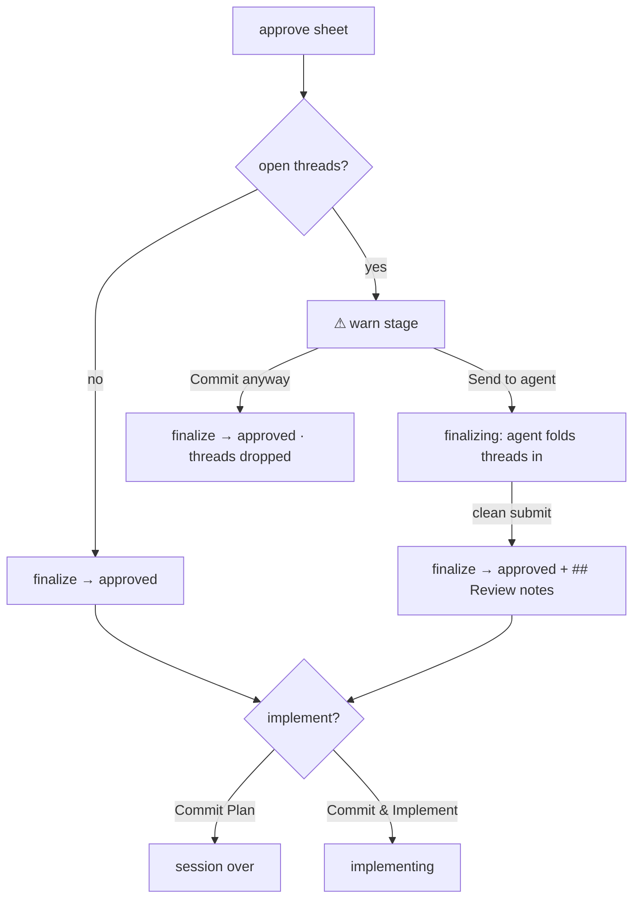
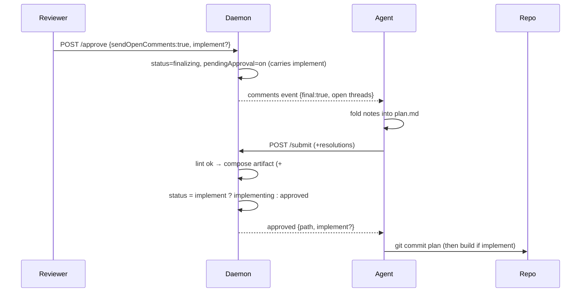

<!-- Reconciled 2026-06-15 against the shipped Approve & Implement flow (#8). The
     approve sheet's two-choice slot is now Commit Plan / Commit & Implement, and
     open threads are handled by a warn → "Commit anyway" (drop) stage. So comment
     & approve no longer relabels the approve button: it adds a "Send to agent"
     fold-in branch to that warning, beside the existing drop. The deferred-
     finalize / `## Review notes` mechanism is unchanged. See D4/D5 and the
     Interview note for what moved. -->

## Summary

Leaving a final nit today means comment → wait for the agent to revise → re-review →
approve: a full round trip for "LGTM, just rename this." The shipped approve sheet
(Commit Plan / Commit & Implement) already catches open threads and offers **commit
anyway** — which silently drops them. This adds the missing third path: **send to
agent**. The agent folds every open thread in on one solo pass, then commits. The
reviewer is done the instant they click; the chosen variant carries through, so a
fold-in can flow straight into Commit & Implement.

## Decisions

- D1: "Send to agent" hands open comments to the agent for one solo fold-in pass;
  the reviewer finishes instantly, finalize defers until the agent commits ← q1
- D2: While finalizing, the review screen is read-only "approving — agent finalizing…",
  flipping to the approved note when the commit lands ← q2
- D3: The fold-in pass sweeps every open thread — nothing sent is silently
  dropped ← q3
- D4: Entry point is the shipped approve sheet's **unresolved-threads warning**, not a
  relabel of the approve button. The confirm stage stays Commit Plan / Commit &
  Implement; the warning (open comments or unanswered questions) gains a "Send to
  agent" action beside today's "Commit anyway" ← q4 (reconciled with the shipped
  Approve & Implement sheet)
- D5: The two warn-stage choices — "Send to agent" (defer + fold-in) vs "Commit
  anyway" (force-drop, finalize now). This extends today's warn→commit-anyway with the
  send branch; it does not replace the confirm stage ← q4
- D6: Mechanism reuses the comments→revise→submit loop; a `pendingApproval` flag
  auto-finalizes the agent's next clean submit instead of returning to in_review ← [assumed]
- D7: A hung finalize is escapable — "Commit anyway" stays available mid-finalize to
  force-finalize the current revision (drop the still-open threads) ← [assumed]
- D8: The committed artifact gains a "## Review notes" section (swept comments + the
  agent's resolutions) so the trusted fold-in is auditable in git ← [assumed]
- D9: Unsent drawer drafts are not open threads — they never trigger the warning and
  aren't swept; the reviewer sends a comment (creating a thread) to include it in the
  fold-in ← q4
- D10: "Send to agent" composes with the chosen variant — the `finalizing` pass
  preserves the Commit Plan vs Commit & Implement choice, so a clean fold-in submit
  finalizes to `approved` or flows on to `implementing` (the `approved` event carries
  `implement:true`) ← [assumed]

| Pick | Warn-stage choice (open threads exist) | What happens                                                  |
| ---- | -------------------------------------- | ------------------------------------------------------------ |
| ✓    | Send to agent                          | agent folds every open thread in (solo pass), then commits; `## Review notes` records it |
|      | Commit anyway                          | finalize the current revision now; open threads dropped (today's shipped behavior)       |

## Phases

### Phase 1 — Daemon: deferred-approval protocol

Goal: Add the send-to-agent path beside the existing force-drop — gather open threads,
defer finalize behind a `pendingApproval` flag + a non-terminal `finalizing` status, and
auto-finalize on the agent's next clean submit. Keep the confirm stage, the immediate
drop path, and the terminal/`implementing` guards intact.

Files:
- src/daemon/app.ts (approve + submit handlers)
- src/daemon/store.ts (pendingApproval flag + finalizing status persistence)
- src/shared/types.ts (SessionStatus + SESSION_STATUSES add `finalizing`; comments-event
  `final` marker; approve-body `sendOpenComments`)
- src/daemon/threads.ts (gather still-open threads)
- src/daemon/app.test.ts, src/daemon/store.test.ts
- DESIGN.md, DECISIONS.md

Verification: bun test (send-to-agent defers; agent submit finalizes; "commit anyway"
finalizes now; send + Commit & Implement finalizes then enters `implementing`; hung
finalize escapable via "commit anyway"), bun run typecheck.

#### Details

- `finalizing` is a new **non-terminal** status (like `implementing`): it is NOT added to
  `TERMINAL_STATUSES`, so the agent's submit still mutates the session, but a fresh
  `approve {sendOpenComments}` while finalizing is refused (akin to `E_ALREADY_IMPLEMENTING`).
- New approve mode `{sendOpenComments:true}`: writes no artifact yet; sets `finalizing`
  and a `pendingApproval` flag carrying the `implement` choice, so the review screen goes
  read-only and the fold-in remembers whether to build afterward.
- `final:true` on the comments event tells the agent this is the last pass.
- The submit handler, when `pendingApproval` is set, composes + writes the artifact and
  flips `approved` (or `implementing` when `pendingApproval.implement`), queuing the
  `approved {path, implement?}` event instead of returning to `in_review`.
- "Commit anyway" is the existing `{force:true}` path — it still works during `finalizing`
  as the manual escape, force-dropping the still-open threads.
- A concurrent normal submit serializes on the existing sessionEnded / double-approve guard.

### Phase 2 — Artifact: record the trusted fold-in

Goal: Extend composeArtifact to append a "## Review notes" section — the swept comments
and the agent's resolutions — so an unreviewed fold-in stays auditable in git.

Files:
- src/daemon/approve.ts
- src/daemon/approve.test.ts

Verification: bun test approve.test.ts (review-notes rendered with comment + resolution;
section omitted when the approve carried no fold-in).

### Phase 3 — UI: send-to-agent action + finalizing state

Goal: Add the "Send to agent" action to the approve sheet's warn stage (beside "Commit
anyway"), preserving the Commit Plan vs Commit & Implement variant the user chose; wire
the read-only "approving — finalizing…" frame that flips to the approved note on the
commit frame. The confirm stage is unchanged.

Files:
- src/ui/review/approve.tsx (warn-stage "Send to agent"; carries pendingImplement)
- src/ui/session-screen.tsx (finalizing frame → approved note)
- src/ui/api.ts (postApprove gains `sendOpenComments`)

Verification: bun run build (UI compiles); bun run verify:branch visuals — manually walk
warn→send vs warn→commit-anyway, finalizing→approved, and send + Commit & Implement →
implementing.

### Phase 4 — Agent protocol surface (dogfood skill)

Goal: Teach the agent loop the deferred path: a `final:true` comments batch means "fold
in; your next clean submit finalizes — expect approved (which may carry `implement:true`),
not re-review." Update the wrapper and regenerate the skill md.

Files:
- src/cli/install/assets.ts
- .claude/skills/otacon/SKILL.md (regenerated)
- src/cli/install/assets.test.ts

Verification: bun test assets.test.ts (committed skill md equals generated output);
bun run typecheck.

## Risks

> [!risk]
> The fold-in is unreviewable — the agent can mis-apply or over-edit a note and the
> reviewer can't object once finalized. The "## Review notes" git trail is the only check.

> [!risk]
> A crashed or hung agent leaves the session stuck `finalizing` with no commit; "Commit
> anyway" (D7) is the manual escape, but nothing auto-recovers.

- Premature send: a comment already "sent now" may be mid-revise when send-to-agent
  arrives; the `final:true` batch must supersede in-flight work, not duplicate it.
- Double-finalize race: a concurrent normal submit and the send-to-agent finalize must
  serialize on `pendingApproval` + sessionEnded, like today's double-approve guard.
- Implement composition: a fold-in carrying `implement:true` must flip straight to
  `implementing` (not a terminal `approved`) so the agent enters the build loop — the
  same non-terminal handling the shipped Approve & Implement relies on.
- Scope creep in the final pass: "fold in" stays schema-linted, so the agent cannot
  smuggle new scope into a plan the reviewer has already left.

## Open Questions

- Should the warn stage also offer an inline "last note" box, or is authoring strictly
  via the composer/drawer (stack a draft, then send)? Leaning composer-only.
- Do we need a finalize timeout that auto-falls-back to drop after a hung agent, or is the
  manual "Commit anyway" escape (D7) enough?
- When "Send to agent" is chosen on a Commit & Implement, the fold-in finalizes then
  builds without re-presenting the sheet (D10). Confirm that's wanted vs a pause-to-
  reconfirm before the build starts. Leaning straight-through.

## Interview

> _Note: q4's entry point (a relabeled "approve…" button with two comment choices) was
> later reconciled against the shipped Approve & Implement sheet — the send-vs-drop fork
> now lives in the unresolved-threads warning (see D4/D5). The answers below are the
> original record._

### q1 — When you 'comment & approve', who acts on the parting comment? (A) It's recorded as a 'Reviewer notes' section in the committed docs/plans/ artifact — the *implementation* session reads & honors it; the planning agent just commits, true LGTM-with-nit, zero round trip. (B) The current planning agent receives it as a final event, folds it into the plan text, THEN commits (slight latency; you can't see the result since the session's over). (C) Both — agent folds in what it cleanly can AND the raw note is recorded for implementation.

- Options: Recorded for implementation (recommended) | Agent folds in now | Both
- Answer: Agent folds in now

### q2 — Since the agent folds your note in before the plan commits, approval is briefly deferred (the agent does one solo pass, then it's committed). What should the reviewer screen do in that window?

- Options: Read-only 'approving — agent finalizing…', flips to the approved note when commit lands (recommended) | Show the approved note now, with a small 'finalizing…' sub-status until commit lands | Optimistic: show 'approved' immediately as if it's already done
- Answer: Read-only 'approving — agent finalizing…', flips to the approved note when commit lands

### q3 — Besides the new parting comment, should comment & approve also hand the agent any still-open comment threads to address in the same final fold-in pass? (Today, force-approving silently drops open threads — they 'end with the session'.)

- Options: Yes — sweep all open threads into the final pass; nothing gets dropped (recommended) | No — only the one new parting comment; existing open threads still drop as today
- Answer: Yes — sweep all open threads into the final pass; nothing gets dropped

### q4 — Where do you launch 'comment & approve' from? (You'll often want the nit anchored to specific plan text, which the composer already captures.)

- Options: From the comment composer: select text → write nit → 'Comment & approve' (routes through the approve confirm sheet) (recommended) | From the approve sheet: a note box added to the confirm dialog | Both
- Answer: the entry point should be next to "approve". We need to introduce a new option when there are open comments called "comment & approve". By default, "approve" button approves the session right away. When there are comments, it changes to "approve...", on click, it provides two options, one to approve without addressing open comment, the other approve by sending the open comment
