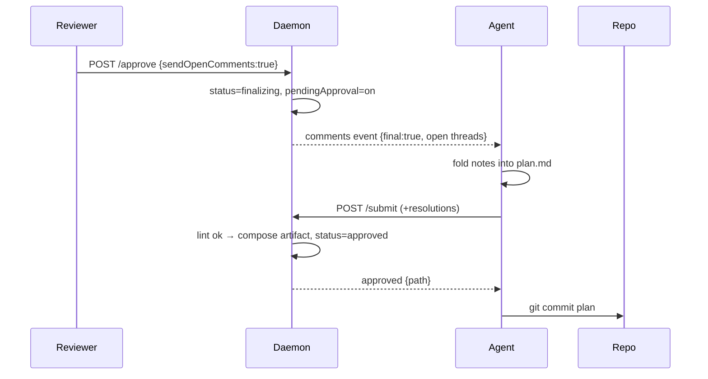

## Summary

Leaving a final nit today means comment → wait for the agent to revise → re-review →
approve: a full round trip for "LGTM, just rename this." This adds an **approve-and-send**
path. When open comments exist the header **approve** button becomes **approve…** with two
choices: *send the open comments* (the agent folds them in on one solo pass, then commits)
or *approve without addressing* (today's drop). The reviewer is done the instant they click.

## Decisions

- D1: "Comment & approve" hands open comments to the agent for one solo fold-in pass;
  the reviewer finishes instantly, finalize defers until the agent commits ← q1
- D2: While finalizing, the review screen is read-only "approving — agent finalizing…",
  flipping to the approved note when the commit lands ← q2
- D3: The fold-in pass sweeps every open comment thread — nothing sent is silently
  dropped ← q3
- D4: Entry point is the header approve button: plain "approve" by default; it becomes
  "approve…" (the two-choice sheet) only when a real open comment thread exists (per t1) ← q4
- D5: The two choices — "approve & send" (defer + fold-in) vs "approve without addressing"
  (force-drop, finalize now); replaces today's warn→approve-anyway ← q4
- D6: Mechanism reuses the comments→revise→submit loop; a `pendingApproval` flag
  auto-finalizes the agent's next clean submit instead of returning to in_review ← [assumed]
- D7: A hung finalize is escapable — the drop choice stays available mid-finalize to
  force-finalize the current revision ← [assumed]
- D8: The committed artifact gains a "## Review notes" section (swept comments + the
  agent's resolutions) so the trusted fold-in is auditable in git ← [assumed]
- D9: Unsent drawer drafts never arm approve… and aren't swept — the reviewer sends a
  comment (creating a thread) to include it in the fold-in (per t1) ← q4

| Pick | Approve choice (open comments exist) | What happens                                            |
| ---- | ------------------------------------ | ------------------------------------------------------- |
| ✓    | Approve & send comments              | agent folds the open comments in (solo pass), then commits |
|      | Approve without addressing           | finalize the current revision now; open comments dropped   |

## Phases

### Phase 1 — Daemon: deferred-approval protocol

Goal: Add the approve-and-send path — gather open threads, defer finalize behind a
`pendingApproval` flag, and auto-finalize on the agent's next clean submit. Keep the
immediate drop path and the double-approve guard intact.

Files:
- src/daemon/app.ts (approve + submit handlers)
- src/daemon/store.ts (pendingApproval flag + finalizing status)
- src/shared/types.ts (SessionStatus, comments-event `final` marker)
- src/daemon/threads.ts (gather still-open threads)
- src/daemon/app.test.ts, src/daemon/store.test.ts
- DESIGN.md, DECISIONS.md

Verification: bun test (approve&send defers; agent submit finalizes; drop finalizes now;
hung finalize escapable via drop), bun run typecheck.

#### Details

- New approve mode `{sendOpenComments:true}`: writes no artifact yet; sets a `finalizing`
  status (or `revising`+`pendingApproval`) so the review screen goes read-only.
- `final:true` on the comments event tells the agent this is the last pass.
- The submit handler, when `pendingApproval` is set, composes + writes the artifact and
  flips `approved` (queuing the `approved` event) instead of returning to `in_review`.
- A concurrent normal submit serializes on the existing sessionEnded / double-approve guard.

### Phase 2 — Artifact: record the trusted fold-in

Goal: Extend composeArtifact to append a "## Review notes" section — the swept comments
and the agent's resolutions — so an unreviewed fold-in stays auditable in git.

Files:
- src/daemon/approve.ts
- src/daemon/approve.test.ts

Verification: bun test approve.test.ts (review-notes rendered with comment + resolution;
section omitted when the approve carried no comments).

### Phase 3 — UI: context-aware approve + finalizing state

Goal: Make the header approve button "approve…" when an open comment thread exists,
opening the two-choice sheet; wire the read-only "approving — finalizing…" state that flips
to the approved note on the commit frame.

Files:
- src/ui/review/header.tsx
- src/ui/review/approve.tsx
- src/ui/session-screen.tsx
- src/ui/api.ts

Verification: bun run build (UI compiles); bun run verify:branch visuals — manually walk
approve…→send vs →drop and finalizing→approved.

### Phase 4 — Agent protocol surface (dogfood skill)

Goal: Teach the agent loop the deferred path: a `final:true` comments batch means "fold in;
your next submit finalizes — expect approved, not re-review." Update the wrapper and
regenerate the skill md.

Files:
- src/cli/install/assets.ts
- .claude/skills/otacon/SKILL.md (regenerated)
- src/cli/install/assets.test.ts

Verification: bun test assets.test.ts (committed skill md equals generated output);
bun run typecheck.

## Risks

> [!risk]
> The fold-in is unreviewable — the agent can mis-apply or over-edit a note and the
> reviewer can't object once finalized. The "## Review notes" git trail is the only check.

> [!risk]
> A crashed or hung agent leaves the session stuck "finalizing" with no commit; the drop
> choice (D7) is the manual escape, but nothing auto-recovers.

- Premature send: a comment already "sent now" may be mid-revise when approve&send
  arrives; the `final:true` batch must supersede in-flight work, not duplicate it.
- Double-finalize race: a concurrent normal submit and the approve&send finalize must
  serialize on `pendingApproval` + sessionEnded, like today's double-approve guard.
- Scope creep in the final pass: "fold in" stays schema-linted, so the agent cannot
  smuggle new scope into a plan the reviewer has already left.

## Open Questions

- Should the approve sheet also offer an inline "last note" box, or is authoring strictly
  via the composer/drawer (stack a draft, then approve & send)? Leaning composer-only.
- Do we need a finalize timeout that auto-falls-back to drop after a hung agent, or is the
  manual drop escape (D7) enough?

## Interview

### q1 — When you 'comment & approve', who acts on the parting comment? (A) It's recorded as a 'Reviewer notes' section in the committed docs/plans/ artifact — the *implementation* session reads & honors it; the planning agent just commits, true LGTM-with-nit, zero round trip. (B) The current planning agent receives it as a final event, folds it into the plan text, THEN commits (slight latency; you can't see the result since the session's over). (C) Both — agent folds in what it cleanly can AND the raw note is recorded for implementation.

- Options: Recorded for implementation (recommended) | Agent folds in now | Both
- Answer: Agent folds in now

### q2 — Since the agent folds your note in before the plan commits, approval is briefly deferred (the agent does one solo pass, then it's committed). What should the reviewer screen do in that window?

- Options: Read-only 'approving — agent finalizing…', flips to the approved note when commit lands (recommended) | Show the approved note now, with a small 'finalizing…' sub-status until commit lands | Optimistic: show 'approved' immediately as if it's already done
- Answer: Read-only 'approving — agent finalizing…', flips to the approved note when commit lands

### q3 — Besides the new parting comment, should comment & approve also hand the agent any still-open comment threads to address in the same final fold-in pass? (Today, force-approving silently drops open threads — they 'end with the session'.)

- Options: Yes — sweep all open threads into the final pass; nothing gets dropped (recommended) | No — only the one new parting comment; existing open threads still drop as today
- Answer: Yes — sweep all open threads into the final pass; nothing gets dropped

### q4 — Where do you launch 'comment & approve' from? (You'll often want the nit anchored to specific plan text, which the composer already captures.)

- Options: From the comment composer: select text → write nit → 'Comment & approve' (routes through the approve confirm sheet) (recommended) | From the approve sheet: a note box added to the confirm dialog | Both
- Answer: the entry point should be next to "approve". We need to introduce a new option when there are open comments called "comment & approve". By default, "approve" button approves the session right away. When there are comments, it changes to "approve...", on click, it provides two options, one to approve without addressing open comment, the other approve by sending the open comment
