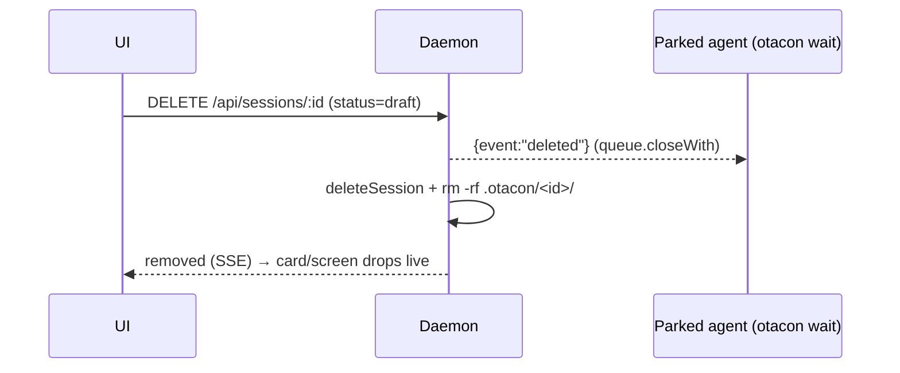

## Summary

Let the reviewer permanently delete a pending (non-approved) session from the
browser/phone — clearing abandoned drafts that clutter the index (today deletion is
CLI-only and approved-only). We relax `DELETE /api/sessions/:id` to accept pending
sessions, hard-remove their working state, and wake any parked agent with a terminal
`deleted` event so it stops cleanly. A confirm sheet on both surfaces drives it.

## Decisions

- D1: Delete lives in the browser/phone UI only — no new CLI verb. ← q1
- D2: A pending session's `.otacon/<id>/` is hard-removed (permanent, no undo); approved sessions still archive via `otacon clean`. ← q2
- D3: Deleting wakes a parked agent immediately with a terminal `{event:"deleted"}` so it stops, instead of letting it 404 later. ← q3
- D4: The delete control appears on both the index card and the open session screen. ← q4
- D5: A confirm sheet (mirroring the approve sheet) gates the delete — copy is honest that it is permanent. ← q5
- D6: Reuse `DELETE /api/sessions/:id` (relaxed guard) and the existing `removed` SSE frame — no new endpoint or browser frame. [assumed]
- D7: "Pending" = any non-approved status (`draft`/`in_review`/`revising`); approved-session removal stays `clean`'s job. [assumed]

## Phases

### Phase 1 — Daemon: delete a pending session, wake the parked agent

Goal: `DELETE /api/sessions/:id` accepts non-approved sessions — wake any parked
waiter with a terminal `deleted` event, deregister, hard-remove `.otacon/<id>/`,
publish the existing `removed` frame. Approved sessions keep today's clean path.

Files:
- `src/shared/types.ts` — add `{ event: "deleted"; session: string }` to `EventPayload`.
- `src/daemon/queue.ts` — add `closeWith(event)`: deliver a synthetic terminal event to every parked waiter, then mark closed (no disk writes).
- `src/daemon/store.ts` — add `removeSessionDir(id)` (hard `rm -rf .otacon/<id>/`), captured before deregister.
- `src/daemon/app.ts` — branch the DELETE handler on status: approved → today's path; non-approved → wake + deregister + hard-remove + `removed`.
- `src/daemon/queue.test.ts`, `src/daemon/app.test.ts` — cover wake-and-delete and the parked-agent terminal event.
- `DESIGN.md` §12 + `DECISIONS.md` — record the pending-delete path and the approved-archive vs pending-hard-delete asymmetry (revisits the existing "clean" decision).

Verification: `bun test src/daemon`, `bun run typecheck`. New test: a parked
`/events` long-poll resolves with `{event:"deleted"}` the moment the session is
deleted, and `.otacon/<id>/` is gone afterward.

#### Details

Ordering matters (mirrors `clean`'s deregister-then-move): wake waiters **before**
`store.deleteSession` so `respondEvent` still resolves cleanly, then hard-remove the
dir after `closeWith` so a late unacked flush can't recreate it. `closeWith` sets
`closed = true` first (making `flush`/`requeue` no-ops) and then fires each waiter.

An agent that is **not** parked when the delete lands isn't reachable; its next
`wait` resolves against a vanished session and exits via the existing
`E_NO_SESSION`/404 recovery the wrapper already documents.

### Phase 2 — CLI/agent protocol: teach the loop to stop on `deleted`

Goal: `otacon wait` already prints any non-timeout event and exits 0, so `deleted`
flows through unchanged — the only work is documenting it so the agent stops instead
of re-parking or treating it as an error.

Files:
- `src/cli/install/assets.ts` — add a `deleted → the session was deleted in the review UI: stop, the session is over` branch to the wrapper's review-loop step.
- `.claude/skills/otacon/SKILL.md` — regenerate from `assets.ts` (generated file; `assets.test.ts` guards equality).
- `src/cli/install/assets.test.ts` — assert the new wrapper text is present.

Verification: `bun test src/cli/install`, then confirm the regenerated skill file
equals `dogfoodSkillMd` output (the existing guard test).

### Phase 3 — UI: delete control + confirm sheet on both surfaces

Goal: a small delete affordance on each pending session's index card and on the open
session screen, both opening one confirm sheet; on success the existing `removed`
frame drops the card / flips the screen, and the session screen navigates home.

Files:
- `src/ui/api.ts` — add `postDelete(id)` (DELETE; true on 200). `removed` handling already exists in both hooks.
- `src/ui/review/delete.tsx` — new `DeleteDialog` confirm sheet (mirrors `approve.tsx`; permanent-delete copy).
- `src/ui/index-screen.tsx` — trailing delete button on the card; `stopPropagation`/`preventDefault` so it doesn't navigate. Pending sessions only.
- `src/ui/session-screen.tsx` — delete control in the header for pending sessions; on success `navigate("/")`.
- `src/ui/styles.css` — reuse approve-sheet styling; small card-delete button.
- `src/ui/*.test.ts(x)` as the components warrant.

Verification: `bun run build` (UI bundles), `bun run verify:branch full` — delete a
draft from the index and from its screen; confirm the card drops and a parked agent
session stops.

## Risks

- Hard delete is irreversible — the confirm sheet is the only guard; there is no undo (D2/D5).
- The wake only reaches a currently-parked agent; otherwise the agent discovers deletion via the existing 404/`E_NO_SESSION` path — acceptable, but document it.
- Status-branched DELETE (approved→archive, pending→hard-delete) is an asymmetry; without DESIGN/DECISIONS notes it will surprise a future reader.
- The index card is an `<a>`; a delete control that forgets to stop propagation navigates instead of deleting.
- Agents running an older wrapper won't recognize `deleted`; they fall back to 404 recovery — degraded, not broken.

## Open Questions

- Index-card affordance: always-visible small icon (assumed) vs swipe-to-reveal — revisit if the icon feels cluttered on the list.
- The shared `removed` terminal state on the session screen currently reads "session cleaned"; should it say "deleted" when hard-removed, or stay generic? (Assumed: soften copy to cover both.)

## Interview

### q1 — Where should 'delete a pending session' live? (Today deletion is CLI-only via 'otacon clean', and only for approved sessions — there's no UI control at all.)

- Options: Browser/phone UI only (recommended) | Browser UI + a CLI verb | CLI only
- Answer: Browser/phone UI only

### q2 — When you delete a pending session, what happens to its working state on disk (.otacon/<id>/ — draft plan, grill transcript, comments)?

- Options: Archive it (move to .otacon/archive/, recoverable — same as 'otacon clean' does for approved sessions) (recommended) | Delete it permanently (hard remove the directory)
- Answer: Delete it permanently (hard remove the directory)

### q3 — If you delete a session while its agent is parked in 'otacon wait' (or actively revising), how should the agent find out?

- Options: Wake it immediately with a terminal 'deleted' event so it stops cleanly right away (recommended) | Let it discover passively (its next wait/call 404s on its own within a few minutes)
- Answer: Wake it immediately with a terminal 'deleted' event so it stops cleanly right away

### q4 — Where should the delete control appear in the UI?

- Options: Both the index card (clear list clutter) and the open session screen (recommended) | On the open session screen only | On the index card only
- Answer: Both the index card (clear list clutter) and the open session screen

### q5 — Deleting is now permanent (no archive). How much confirmation friction on the phone before it deletes?

- Options: Confirm sheet: tap delete → 'Delete this session? Permanently removes the draft plan and grill — can't be undone.' → confirm (recommended) | Two-tap inline: the button arms to 'Confirm?', a second tap deletes (no sheet) | No confirm — delete on tap (deliberate gesture)
- Answer: Confirm sheet: tap delete → 'Delete this session? Permanently removes the draft plan and grill — can't be undone.' → confirm
