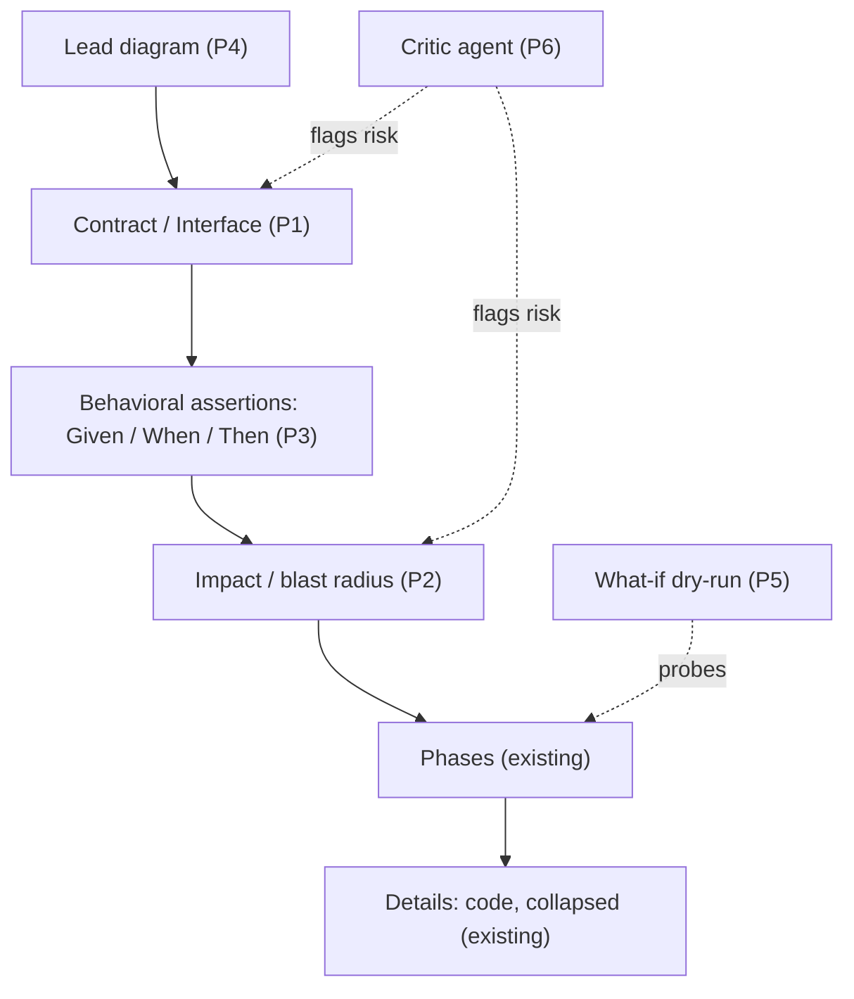

## Summary

Reframe otacon plans around **review altitude**: lead with contract, behavior, and
blast radius so the human reviews *intent and risk*, not implementation steps. This
roadmap sequences all eight brainstorm ideas as separate PRs. Otacon already serves
three of them — alternatives (Decisions matrix), diagrams (mermaid), version narrative
(r2+ changelog) — so those need no new work, and semantic diff is dropped.



## Decisions

- D1: Ship a roadmap of all eight ideas as sequenced, individually-shippable PRs rather than one change ← q1
- D2: Critic agent is advisory and human-triggered — a dismissible "critic" voice in the rail that never blocks approval ← q2
- D3: Contract and Impact land as optional H2 sections; behavioral assertions as a fenced block inside Verification ← q3
- D4: Drop semantic diff — the existing r2+ changelog already narrates version deltas ← q4
- D5: Critic runs as an agent-spawned subagent via a new `otacon critique` verb; the daemon stays LLM-free ← q5
- D6: Strongly recommend a lead diagram up top (~90% of plans, with an escape hatch); keep the existing ≤5-line Summary as the headline — no forced one-liner; phases stay expanded ← q6
- D7: Behavioral assertions use ` ```gwt ` Given/When/Then scenario cards that double as the approve checklist ← q7
- D8: Order — schema foundation → first-screen/auto-diagram → what-if → critic (heaviest last) ← q8
- D9: What-if dry-run stays the lightweight inline-ask pattern + a "simulate" affordance — confirmed sufficient in review, no richer sandbox [assumed]
- D10: "Alternatives considered" needs no new phase — the Decisions matrix already serves it [assumed]
- D11: Critic starts as a fixed prompt template in assets.ts; an optional per-repo critic profile is deferred until the fixed bar proves too generic [assumed]
- D12: No "altitude" collapse-all toggle — the lead diagram plus the existing Details collapse cover progressive disclosure [assumed]

| Pick | Critic stance              | Tradeoff                                            |
| ---- | -------------------------- | -------------------------------------------------- |
| ✓    | Advisory, human-triggered  | catches risk without gating human judgment         |
|      | Blocking gate              | rigor, but stalls review on critic false-positives |
|      | Drop it                    | simplest, but the human faces the long plan alone  |

## Phases

### Phase 1 — Optional-section scaffolding + Contract

Goal: Teach the schema to support *optional* H2 sections interleaved in the fixed
order, and land the first one — `## Contract`: the interface/data-schema surface
(inputs, outputs, types) the reviewer signs off instead of reading implementation.

Files:
- src/daemon/linter/rules.ts — REQUIRED_SECTIONS → ordered list with an `optional` flag; order check tolerant of absent optionals
- src/daemon/linter/parse.ts — recognize the optional section
- src/shared/config.ts — Contract line/visual budgets
- src/ui/plan/parse.ts, src/ui/plan/plan-view.tsx — render the Contract block
- src/cli/install/assets.ts — schema doc + dogfood SKILL.md
- DESIGN.md, DECISIONS.md

Verification: bun test covers Contract present / absent / out-of-order; bun run
typecheck; dogfood a plan with and without Contract through submit; assets.test.ts
still matches.

### Phase 2 — Impact / blast-radius section

Goal: Add optional `## Impact` — upstream modules this plan depends on and downstream
modules it can break — reusing Phase-1's optional-section machinery. Render as a
compact dependency list (an optional dependency mermaid is allowed under the 1-fence rule).

Files:
- src/daemon/linter/rules.ts, src/daemon/linter/parse.ts — Impact recognition + budget
- src/shared/config.ts — Impact budgets
- src/ui/plan/parse.ts, src/ui/plan/plan-view.tsx — render Impact
- src/cli/install/assets.ts, DESIGN.md, DECISIONS.md

Verification: bun test for Impact lint cases; typecheck; dogfood a plan carrying an
Impact section plus a dependency mermaid; assets.test.ts matches.

### Phase 3 — Behavioral assertions (gwt) in Verification

Goal: Add a fenced ` ```gwt ` block (Given/When/Then) usable inside each phase's
Verification; parser + linter validate its shape and budget; the UI renders scenario
cards that become the human's Test-Driven Review approve checklist.

Files:
- src/daemon/linter/parse.ts — parse the gwt fence into scenarios
- src/daemon/linter/rules.ts — validate Given/When/Then shape + budget
- src/ui/plan/marked-setup.ts — register the block
- src/ui/plan/code.tsx (or a new scenario-card component) — render cards
- src/cli/install/assets.ts, DESIGN.md, DECISIONS.md

Verification: bun test on well-formed and malformed gwt blocks; typecheck; dogfood a
phase with a gwt block; confirm cards render legibly on the phone width.

### Phase 4 — First screen: lead diagram

Goal: Strongly recommend (not require) a lead diagram near the top — ~90% target, with
an explicit escape hatch when a chart isn't meaningful. Keep the existing ≤5-line
Summary as the headline; no forced one-liner. UI pins Summary + lead diagram first.

Files:
- src/daemon/linter/rules.ts — lead-diagram recommendation nudge (not an error), with an escape-hatch marker
- src/ui/plan/plan-view.tsx — pin Summary + lead diagram as the first screen
- src/cli/install/assets.ts — protocol: auto-emit a state/sequence diagram, ~90% target
- DESIGN.md, DECISIONS.md

Verification: bun test — present → ok, absent → nudge (never a blocking error), escape
hatch suppresses the nudge; typecheck; dogfood; confirm the first screen leads with
Summary then diagram.

### Phase 5 — What-if dry-run affordance

Goal: Ship the what-if pattern over the existing inline-ask flow — the reviewer
selects an anchor, taps "simulate", and an ask opens pre-framed as a what-if; the agent
answers through the existing `answer` path. No new event types or daemon state.

Files:
- src/ui/review/feedback.tsx — a "simulate" action on the selection toolbar
- src/ui/review/grill.tsx — what-if framing on the composed ask
- src/cli/install/assets.ts — document the what-if pattern
- DESIGN.md, DECISIONS.md

Verification: bun test on the unit-testable UI logic; typecheck; dogfood — select a
phase, tap simulate, the agent answers, the answer lands on a thread.

### Phase 6 — Critic agent (advisory pre-mortem)

Goal: Add `otacon critique` — the coding agent spawns a critic subagent that reads the
latest revision and emits risk findings; the CLI posts them as a distinct, dismissible
"critic" thread batch in the rail. Never blocks approval. The protocol runs it at submit.

Files:
- src/cli/commands/critique.ts, src/cli/main.ts — new verb + dispatch
- src/shared/types.ts — `critic` thread/voice kind + event payload
- src/daemon/store.ts + HTTP route — persist and serve the critic batch
- src/ui/review/rail.tsx — critic-voice styling + dismiss
- src/cli/install/assets.ts — protocol: run critique before submit
- DESIGN.md, DECISIONS.md

Verification: bun test on critic-thread storage and render; typecheck; dogfood — run
critique, findings appear as critic cards, dismiss works, approval is unaffected.

## Risks

- Schema sprawl: every optional section/block adds linter+parser+UI surface; added
  carelessly it bloats the template and inverts the "less to read" goal. Keep Contract/Impact optional and budgeted.
- Critic noise: a low-signal critic floods the rail and trains reviewers to ignore it.
  Needs a tight, high-confidence finding bar and one-tap dismissal.
- Mandated diagrams can turn decorative — an auto-mermaid that restates the summary
  adds reading load. The linter can check presence, never usefulness.
- `gwt` as approve-checklist risks false confidence: agent-authored green scenarios are
  not executed tests; reviewers may over-trust them.
- The optional-section ordering change touches the core linter ordering logic (today a
  fixed contiguous list) — regression risk for every existing plan; needs broad lint tests.

## Open Questions

- None outstanding — the r1 open questions were all resolved in review: what-if stays
  lightweight (D9), critic uses a fixed prompt first (D11), no collapse-all toggle (D12),
  and the lead diagram is strongly-recommended-not-required (D6). See the r2 changelog.

## Interview

### q1 — Your brainstorm has ~8 ideas (contract-first, C4 zoom, blast radius, alternatives, auto-diagram, behavioral/TDR assertions, critic agent, semantic diff, what-if dry-run). What should THIS plan actually deliver? Otacon already has mermaid, a decision matrix (=alternatives), risk callouts, section-diff+changelog, and inline ask — so several ideas are partly done.

- Options: Focused schema spine: add the abstraction-altitude layers that change how plans are CONSTRUCTED (Contract/Interface + Behavioral Assertions + Blast Radius), make the first screen contract-and-risk-first, and list the rest as a sequenced roadmap (recommended) | Broad roadmap: one plan that phases ALL 8 ideas over many PRs | Critic-agent-first: make the automated red-team pre-review the centerpiece | Visualization-first: mandate TL;DR + lead diagram and a risk sidebar, defer schema changes
- Answer: Broad roadmap: one plan that phases ALL 8 ideas over many PRs

### q2 — The Critic Agent (automated red-team pre-mortem) is the biggest pivot — it changes otacon from 'human reviews agent' to 'agent pre-reviews, human reviews highlights.' How should it work?

- Options: Advisory + human-triggered: on submit, a critic pass posts risk findings into the thread rail as a distinct 'critic' voice the human can dismiss or escalate — never blocks approval (recommended) | Blocking gate: critic must pass (or be overridden) before the human sees the plan | Drop it: keep otacon strictly human-in-the-loop, no second AI | Research spike only: include as an exploratory phase, decide mechanics later
- Answer: Advisory + human-triggered: on submit, a critic pass posts risk findings into the thread rail as a distinct 'critic' voice the human can dismiss or escalate — never blocks approval

### q3 — Otacon's schema is a fixed list of 5 H2 sections. To add Contract/Interface, Behavioral Assertions, and Blast Radius/Impact, what's the extension strategy?

- Options: Optional H2 sections (## Contract, ## Behavior, ## Impact): linted when present, not mandatory — agent includes them only when the change warrants, so trivial plans stay small and complex ones scale up (recommended) | New REQUIRED sections: every plan must fill them — maximum rigor, but ceremony on trivial plans | New block types inside existing sections (e.g. assert/contract fences) rather than new sections | Mix: Contract+Impact as optional sections, Behavioral Assertions as a fenced block inside Verification
- Answer: Mix: Contract+Impact as optional sections, Behavioral Assertions as a fenced block inside Verification

### q4 — Otacon already keeps every revision and requires a changelog on r2+. What is the Semantic Diff feature actually adding on top of that?

- Options: Agent-authored structured summary: require the changelog to be a semantic delta ('removed Redis step; moved validation to phase 1') and render it prominently atop the existing section diff | Daemon-computed structural diff: detect sections/phases added/removed/reordered and render a machine summary, no agent involvement | Both: machine structural map + agent-authored narrative on top (recommended) | Drop it: the changelog already covers this
- Answer: Drop it: the changelog already covers this

### q5 — How does the Critic pass actually RUN? Otacon's daemon is deliberately dumb storage (no LLM); the coding agent drives the loop.

- Options: Coding agent self-spawns a critic subagent at submit time, then posts its findings as a distinct 'critic' thread batch into the rail via a new CLI verb (e.g. otacon critique) — fits the architecture, daemon stays LLM-free (recommended) | Daemon runs the critic (daemon gains an LLM dependency) | User clicks 'run critic' in the UI, which signals the waiting agent to do a pass | Agent just writes a self-critique into the plan body, no separate thread
- Answer: Coding agent self-spawns a critic subagent at submit time, then posts its findings as a distinct 'critic' thread batch into the rail via a new CLI verb (e.g. otacon critique) — fits the architecture, daemon stays LLM-free

### q6 — First screen today is Summary (≤5 lines) + sections. The brainstorm wants 'one image first, progressive disclosure' (C4 zoom). What do we mandate?

- Options: One-line TL;DR + a lead diagram at the very top, AND default-collapse Phase bodies so the read path is TL;DR → diagram → Contract → Behavior → Risks; Phases/Details expand on demand (recommended) | Mandate TL;DR + lead diagram, but keep Phases expanded | Just a lead diagram, no TL;DR or collapse change | No mandate — keep all of this optional
- Answer: Mandate TL;DR + lead diagram, but keep Phases expanded

### q7 — The behavioral-assertion block lives inside each phase's Verification (your q3 choice). What syntax and role?

- Options: A fenced ```gwt block of Given/When/Then scenarios, rendered as scenario cards, doubling as the approve checklist the human signs off on (Test-Driven Review) (recommended) | A GFM table with Given | When | Then columns | Plain prose bullets encouraged to follow Given/When/Then, no special block | Reuse/strengthen the existing Verification text only — no new block
- Answer: A fenced ```gwt block of Given/When/Then scenarios, rendered as scenario cards, doubling as the approve checklist the human signs off on (Test-Driven Review)

### q8 — Ship order for the roadmap phases (each phase is its own future PR)?

- Options: Schema foundation first (Contract+Impact sections + assertion block + linter/UI), then first-screen/auto-diagram, then what-if dry-run, then Critic agent last (heaviest) (recommended) | Critic agent earlier — highest 'wow', build it second | What-if / dry-run first — cheapest, fastest demo | First-screen / visualization first — most visible win
- Answer: Schema foundation first (Contract+Impact sections + assertion block + linter/UI), then first-screen/auto-diagram, then what-if dry-run, then Critic agent last (heaviest)
