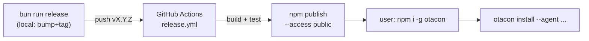
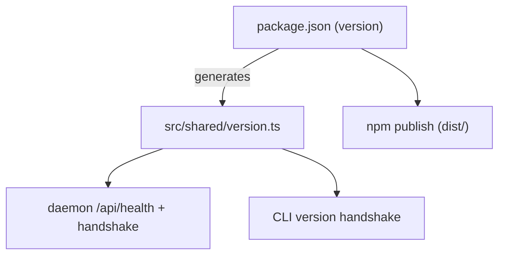

## Summary



Make OTACON installable as a [new] public npm package. A local `bun run release`
bumps the version, tags, and pushes; CI builds, tests, and publishes on the tag.
`package.json` becomes the single version source. Docs split: README user-facing,
a [new] `RELEASING.md` for maintainer steps.

## Contract

```text
bun run release [patch|minor|major]   # preflight → npm version → push commit+tag (NO publish)
git push --follow-tags                 # tag vX.Y.Z triggers CI publish
```

- `npm version` runs the `version` lifecycle → regenerates `src/shared/version.ts`
  from `package.json` and stages it (package.json is the sole source of truth).
- `prepublishOnly` → `npm run build` (publish always ships a fresh `dist/`).
- CI `release.yml`: trigger `push: tags: ['v*']`; needs repo secret `NPM_TOKEN`
  (npm **automation** token). Publishes to dist-tag `latest`.
- User surface unchanged except install path: `npm i -g otacon`, then existing
  `otacon install --agent claude|codex|opencode [--all] [--hooks]`.

## Decisions

| Pick | Channel                       | Tradeoff                                              |
| ---- | ----------------------------- | ---------------------------------------------------- |
| ✓    | Public npm (`otacon`)         | prebuilt artifact, `npm update -g`, trivial install  |
|      | GitHub install only           | builds on every user install (full vite/react deps)  |

- D1: Distribute as public npm `otacon`; GitHub install stays a bleeding-edge fallback ← q1
- D2: Release = local `bun run release` (bump+tag+push); CI publishes on the tag ← q2
- D3: `package.json` is the single version source; `src/shared/version.ts` becomes generated ← q3
- D4: Maintainer steps live in new `RELEASING.md`; README stays user-facing ← q4
- D5: README surfaces the existing `otacon install --agent/--all/--hooks` options ← q5
- D6: `version.ts` regenerated via the `version` npm lifecycle hook + at build [assumed]

## Impact



- Upstream lean: `version.ts` is consumed by the daemon health/version handshake
  (`src/daemon/main.ts`, `app.ts`) and the CLI restart-on-mismatch logic.
- `version.test.ts` already guards `VERSION === package.json.version` — the
  generator must keep it true; tests catch drift.
- New `.github/workflows/` is the repo's first CI; nothing else depends on it.

## Phases

### Phase 1 — npm-publishable package + single-source version

Goal: Package publishes a prebuilt `dist/`; `VERSION` derives from `package.json`
so a bump touches one file. `src/shared/version.ts` becomes a generated mirror
(like the dogfood SKILL.md), package.json authoritative.

Files:
- `package.json` — add `prepublishOnly`, `version` lifecycle, `gen:version`, `release` stubs
- `scripts/gen-version.ts` (new) — read package.json, write `version.ts`
- `src/shared/version.ts` — now generated output
- `LICENSE` — add MIT if absent

Verification: `bun test` (version test green), `bun run build` + `node dist/cli/main.js`
runs, `npm pack --dry-run` lists `dist/` + `package.json` + README + LICENSE only.
```gwt
Given package.json version is bumped to 0.2.0
When the `version` lifecycle / `bun run gen:version` runs
Then src/shared/version.ts exports "0.2.0" and version.test.ts passes
```

### Phase 2 — local release script

Goal: `bun run release [patch|minor|major]` does preflight (clean tree, on default
branch, `bun test` + `typecheck` + `build` green), then `npm version <kind>` (fires
the gen hook), then pushes the commit and tag. It never publishes.

Files:
- `scripts/release.sh` (new)
- `package.json` — `"release"` → the script

Verification: `shellcheck scripts/release.sh`; dry-run with publish/push stubbed.
```gwt
Given a dirty working tree
When I run `bun run release patch`
Then it aborts before bumping and prints why

Given a clean tree on the default branch with green gates
When I run `bun run release patch`
Then package.json + version.ts bump, a vX.Y.Z tag is created and pushed
```

### Phase 3 — CI publish-on-tag workflow

Goal: Pushing a `v*` tag triggers GitHub Actions to install, build, test, and
`npm publish --access public` using `NPM_TOKEN`, then create a GitHub Release.

Files:
- `.github/workflows/release.yml` (new)

Verification: `actionlint .github/workflows/release.yml`; the build+test steps mirror
repo gates; publish step gated on tests passing.
```gwt
Given a pushed tag v0.2.0 and NPM_TOKEN configured
When release.yml runs
Then it builds, tests, publishes otacon@0.2.0 to npm, and cuts a GitHub Release

Given the test step fails
When release.yml runs
Then it stops before npm publish
```

### Phase 4 — docs: README, RELEASING.md, DESIGN.md, DECISIONS.md

Goal: README leads with `npm i -g otacon` + install options; new `RELEASING.md`
holds maintainer steps (NPM_TOKEN, `bun run release`, dist-tags, rollback);
DESIGN.md §16 drops the hedge; DECISIONS.md records D1–D6.

Files:
- `README.md` — npm-primary install, options, GitHub demoted to bleeding-edge note
- `RELEASING.md` (new) — maintainer release runbook
- `DESIGN.md` — §16 install/update update
- `DECISIONS.md` — D1–D6 entries

Verification: links resolve; README install commands match the shipped `bin`/scripts;
`assets.test.ts` still green (no protocol-card change).

## Risks

> [!risk]
> The npm name `otacon` may be unavailable at publish time — fall back to scoped
> `@zeroliu/otacon` (changes the install command + bin docs).

> [!risk]
> `NPM_TOKEN` must be an npm **automation** token, else CI publish fails 2FA.

- GitHub bleeding-edge install still needs a build-on-install (`prepare`); left
  unsupported for now — README frames it as advanced/optional only.
- If the `version` generator is skipped, dist `VERSION` drifts from package.json;
  mitigated by `version.test.ts` + running gen in both `version` hook and build.
- First CI in the repo: a publish workflow with a soft preflight could ship a bad
  tag; release.sh gates locally and CI re-runs tests before publish.

## Open Questions

- Add a separate PR CI (test/typecheck/build on pull requests) now, or defer?
- Unscoped `otacon` vs scoped `@zeroliu/otacon` — confirm name ownership before first publish.
- Fully support the GitHub bleeding-edge install (add `prepare` build), or drop it from docs?

## Interview

### q1 — How should end users get the production OTACON? (Today the advertised github install would fail — no built dist is shipped.)

- Options: Public npm registry (npm i -g otacon) (recommended) | GitHub install from repo (npm i -g github:zeroliu/otacon#vX.Y.Z) | Both — publish npm, keep GitHub as fallback
- Answer: Public npm registry (npm i -g otacon)

### q2 — How should a release be cut and published to npm?

- Options: Local script (bun run release): bump version, build, npm publish, tag + push — run from your Mac (recommended) | GitHub Actions on tag push: CI builds/tests/publishes when you push vX.Y.Z (needs NPM_TOKEN secret; adds the repo's first CI) | Both: local script bumps+tags+pushes, CI does the publish
- Answer: Both: local script bumps+tags+pushes, CI does the publish

### q3 — Version is currently hardcoded in BOTH package.json and src/shared/version.ts (a test enforces they match). How should bumps work?

- Options: Single source of truth: derive VERSION from package.json so `npm version` is the only bump step (recommended) | Keep both files; the release script rewrites src/shared/version.ts from package.json
- Answer: Single source of truth: derive VERSION from package.json so `npm version` is the only bump step

### q4 — Where should the maintainer release instructions live?

- Options: README gets the user install flow + a short 'Releasing' maintainer section (recommended) | Separate RELEASING.md for maintainer steps; README stays user-facing only | Release steps go in AGENTS.md (agent/maintainer conventions); README user-facing only
- Answer: Separate RELEASING.md for maintainer steps; README stays user-facing only

### q5 — You want users to have 'different options' to adopt OTACON. Which options should the install flow present? (multi-select)

- Options (multi): Agent-wrapper choice: otacon install --agent claude|codex|opencode / --all / --hooks (already built) (recommended) | Channel choice: stable (npm latest) vs pinned version vs GitHub bleeding-edge | Phone access: otacon expose over Tailscale (already built)
- Answer: Agent-wrapper choice: otacon install --agent claude|codex|opencode / --all / --hooks (already built)
