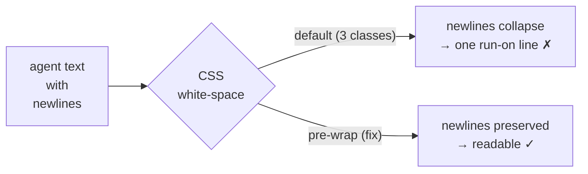

## Summary



Multi-line grill questions and answers render as one run-on line: three card text
classes lack `white-space: pre-wrap`, so the browser collapses agent-authored
newlines. Sibling classes (`thread-body`, `thread-answer-body`, `iv-answer-body`)
already preserve them. Fix [risky-free]: add `pre-wrap` to the three stragglers so
all Q&A text behaves consistently. CSS-only, no markdown, no behavior change.

## Decisions

- D1: Preserve newlines via `white-space: pre-wrap`, not markdown rendering — matches the existing thread/`iv-answer-body` pattern; no new deps on these cards ← q1
- D2: Fix all three affected classes (`grill-question`, `settled-answer`, `iv-q`) in one pass — same root cause, partial fix would leave inconsistent cards ← q2
- D3: No DESIGN.md change — this corrects rendering to match intent; it alters no documented decision, protocol, CLI, lint rule, or storage shape [assumed]

## Phases

### Phase 1 — Add pre-wrap to the three Q&A text classes

Goal: Multi-line grill questions, settled grill answers, and interview questions
preserve agent-authored line breaks, matching thread bodies.

Files:
- `src/ui/styles.css` — add `white-space: pre-wrap;` to `.grill-question` (line ~2799), `.settled-answer` (~2981), `.iv-q` (~3197)

Verification: `bun run typecheck` + `bun run build`; then `bun run verify:branch visuals` and eyeball a multi-line question/answer card on the review screen.

```gwt
Given a grill question whose text contains newlines
When the review screen renders the live and settled cards
Then the line breaks appear as written instead of collapsing to one line

Given an interview question authored with multiple lines
When the interview panel renders it
Then each line is preserved like the answer body already is
```

## Risks

> [!risk]
> `pre-wrap` also preserves long runs of leading/indent whitespace. Agent question
> text is normal prose, so this is cosmetic-only; `overflow-wrap: anywhere` (already
> on all three) still prevents horizontal overflow.

## Open Questions

None.

## Interview

### q1 — How should multi-line Q&A text render? The thread/comment bodies already use `white-space: pre-wrap` (preserve newlines, no markdown). The plan body uses a full Markdown component (marked + DOMPurify).

- Options: pre-wrap (preserve newlines, match thread bodies) (recommended) | Full markdown rendering (reuse the Markdown component) | pre-wrap for answers, markdown for agent questions
- Answer: pre-wrap (preserve newlines, match thread bodies)

### q2 — Which Q&A surfaces should the fix cover? All three share the same missing-pre-wrap root cause.

- Options: All of them: grill question, grill settled answer, interview question (recommended) | Only the grill settled card (question + answer) | Only the live grill question card
- Answer: All of them: grill question, grill settled answer, interview question
