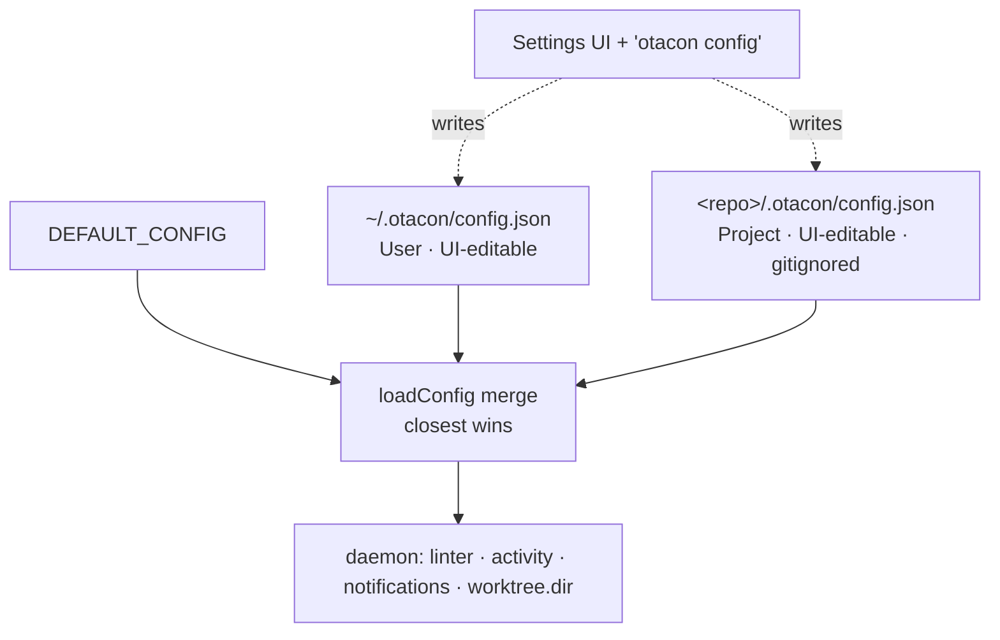
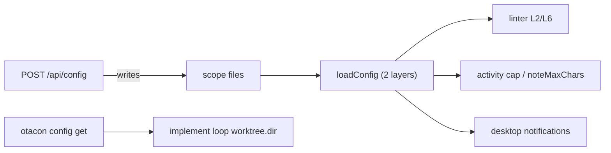

## Summary



Add a [new] Settings web UI and an `otacon config` command to edit every otacon option.
Two **untracked** scopes — **User** (`~/.otacon/config.json`) and **Project**
(`<repo>/.otacon/config.json`, gitignored) — each edited as a raw per-scope file; no
tracked config file remains (the old `otacon.config.json` layer is dropped). A [new]
editable `worktree.dir` controls the impl worktree base. One schema drives every field.

## Contract

```text
GET  /api/config?repo=<root>   -> { schema, scopes:{ user:{path,values}, project:{path,values,repo} } }
POST /api/config { scope:"user"|"project", repo?, values } -> 200 {values} | 422 {fieldErrors}
CLI  otacon config             -> opens  <base>/settings?repo=<cwd-repo-root>
CLI  otacon config get <key>   -> { value }   # merged effective value, read-only
```

- Read order becomes `defaults ← ~/.otacon/config.json ← <repo>/.otacon/config.json`;
  `repoConfigPath` / `otacon.config.json` are removed. `loadConfig(repoRoot?)` unchanged.
- `CONFIG_SCHEMA`: per field `{section,key,label,type:"int"|"bool"|"path",default,min}` —
  one source of truth for render + validate; a guard test covers every key.
- New `worktree.dir` (type path, default `.otacon/worktrees`); the implement loop reads
  it via `otacon config get worktree.dir` instead of hardcoding the path.
- Writes are sparse (cleared field = inherit); User→`~/.otacon/config.json`,
  Project→`<repo>/.otacon/config.json`, both untracked; UI shows the absolute path.
- No repo in context: User scope + `config get` resolve from defaults←user alone;
  Project scope and `POST scope=project` require a repo (known-repos dropdown), else 400.

## Decisions

| Pick | Project local-file location           | Tradeoff                                    |
| ---- | ------------------------------------- | ------------------------------------------- |
| ✓    | `<repo>/.otacon/config.json`          | already-gitignored dir — zero tracked edits |
|      | `otacon.config.local.json` + gitignore | one-time edit to tracked `.gitignore`       |
|      | committed `otacon.config.json`        | UI would mutate a shared, tracked file      |

- D1: Two scopes (User-global + Project-repo); build the editor on the merge ← q1
- D2: Dedicated `/settings`, User|Project toggle, repo from `?repo`/known-repos, show target path ← q2
- D3: Per-scope raw editing — no merged/provenance view ← q3
- D4: `otacon config` opens the Settings URL; a read-only `config get` is added too ← q4
- D5: Drop the old `otacon.config.json` layer — config is two untracked files only [assumed]
- D6: Editable scopes write only untracked files; Project = `<repo>/.otacon/config.json` ← q6
- D7: Add editable `worktree.dir`; the implement loop reads it via `config get` [assumed]
- D8: One `CONFIG_SCHEMA` (int/bool/path) drives render + validate; writes stay sparse [assumed]

## Impact



- `worktree.dir` is consumed by the agent's implement loop via `config get`, not by the
  daemon; the rest is additive (one read-layer swap, one API pair, one CLI, one route).
- DESIGN §17 gets a one-line correction so the spec matches the new two-file hierarchy —
  spec accuracy only (repo doc contract), no migration or user-facing change notes.

## Phases

### Phase 1 — Shared: schema, layer swap, worktree.dir

Goal: Swap the committed layer for `<repo>/.otacon/config.json`, add a `worktree`
section + `worktree.dir`, and a `CONFIG_SCHEMA` (int/bool/path) with sparse
read/validate/serialize helpers the daemon reuses.

Files:
- `src/shared/paths.ts` — add `repoLocalConfigPath`; remove `repoConfigPath`
- `src/shared/config.ts` — schema, `worktree` section, loader layer swap, string merge
- `src/shared/config.test.ts`
- `DESIGN.md` (§17/§6/§15), `DECISIONS.md`

Verification: `bun test config` + `bun run typecheck`.
```gwt
Given ~/.otacon/config.json with summaryLines=7
And <repo>/.otacon/config.json with summaryLines=9
When loadConfig(repo) runs
Then the effective summaryLines is 9 and worktree.dir defaults to .otacon/worktrees

Given CONFIG_SCHEMA
When the guard test runs
Then it enumerates exactly the keys of DEFAULT_CONFIG including worktree.dir
```

### Phase 2 — Daemon: config read/write API

Goal: `GET /api/config` (schema + each scope's raw values + absolute paths) and
`POST /api/config` (schema-validate int/bool/path, sparse-write the chosen scope file),
reusing Phase 1 helpers and the existing same-origin guard.

Files:
- `src/daemon/app.ts` — routes + same-origin guard
- `src/daemon/app.test.ts`
- `DESIGN.md`, `DECISIONS.md`

Verification: `bun test app` + `bun run typecheck`.
```gwt
Given POST /api/config scope=user with budgets.summaryLines=8
When the daemon handles it
Then ~/.otacon/config.json holds only summaryLines=8 and GET echoes it

Given POST /api/config with summaryLines=0
When the daemon validates it
Then it returns 422 with a field error and writes nothing

Given POST /api/config scope=project with no repo
When the daemon handles it
Then it returns 400 (repo required) and writes nothing
```

### Phase 3 — UI: Settings screen (render + navigation)

Goal: Add the `/settings` route and `SettingsScreen` — User|Project toggle (User works
with no repo), repo picker (`?repo` default + known-repos dropdown), prominent target
path, schema-driven fields (number / toggle / path) with defaults shown as placeholders.

Files:
- `src/ui/router.ts`, `src/ui/app.tsx` — `/settings` route
- `src/daemon/ui.ts` — serve SPA shell for `/settings`
- `src/ui/settings-screen.tsx` [new], `src/ui/api.ts` (`useConfig`)
- `src/ui/index-screen.tsx` (Settings link), `src/ui/styles.css` + helper test

Verification: `bun run typecheck` + `bun run build`; unit-test the distinct-repos and
unset-field helpers.

### Phase 4 — UI: editing, validation, save, reset

Goal: Make fields editable; build a sparse POST payload (only changed-from-empty keys);
surface 422 field errors inline; per-field reset-to-inherit (clear); show a saved state.

Files:
- `src/ui/settings-screen.tsx`
- `src/ui/settings-form.ts` [new] + test
- `src/ui/api.ts` (`saveConfig`), `src/ui/styles.css`

Verification: `bun test settings` + `bun run build`.
```gwt
Given the User form with summaryLines edited to 8 and all others untouched
When Save is clicked
Then the POST body carries only budgets.summaryLines=8
```

### Phase 5 — CLI: `otacon config` (+ get) + worktree wiring

Goal: Add `otacon config` (open `/settings?repo=<cwd-repo>`) and read-only
`otacon config get <key>`; point the implement-loop instructions at `worktree.dir`
via `config get`; wire dispatch + help; regenerate the generated skill asset.

Files:
- `src/cli/commands/config.ts` [new] + test
- `src/cli/main.ts` (dispatch + help)
- `src/cli/install/assets.ts` (worktree dir + quick-ref) → regenerate generated skill md
- `DESIGN.md`, `DECISIONS.md`

Verification: `bun test config` + `bun run typecheck` + `bun run build`
(`node dist/cli/main.js config get worktree.dir` prints one JSON line).

## Risks

> [!assumption]
> Editable options are budgets/activity/notifications + the new `worktree.dir`; the
> guard test fails loudly if config grows without a matching schema entry.

- `worktree.dir` is consumed by the agent loop, not the daemon; a bad value (absolute / outside repo) misplaces worktrees — validate non-empty, recommend repo-relative.
- Browser→daemon write is a new surface; mitigate by reusing the same-origin guard plus int/bool/path validation.
- `config get` reintroduces a read CLI (q4 declined get/set editing); keep it strictly read-only so the surface stays small.
- Project scope opened with no repo is inert until one is picked; the UI must make that state obvious rather than silently no-op a save.

## Open Questions

- Migration for a repo that already has `otacon.config.json`: hard-drop (this plan) or a
  one-time import into `.otacon/config.json`? (Leaning hard-drop; none exist yet.)
- Should `worktree.dir` permit absolute paths or enforce repo-relative? (Leaning relative.)

## Interview

### q1 — How far should the config 'folder hierarchy' go? Today loadConfig already merges defaults ← ~/.otacon/config.json (your user profile) ← <repo>/otacon.config.json (the project), and the project file already wins ('closest takes priority'). So part of what you described exists. Which model do you want? (Reading 'Octave config' as 'otacon config' — correct me if not.)

- Options: Two named scopes: user-global + project-repo (existing merge) — build the editing UI on top (recommended) | Multi-folder cascade: also pick up otacon.config.json from ANY ancestor directory (cwd→repo→home), deepest folder wins | Three layers: user-global + project-committed + a gitignored project-local override that wins
- Answer: Two named scopes: user-global + project-repo (existing merge) — build the editing UI on top

### q2 — Where do you edit config in the UI, and how is the project's repo picked? (User-global config needs no repo; project config does.)

- Options: Dedicated Settings screen with a User | Project toggle; for Project, choose the repo from a dropdown of repos that have otacon sessions (defaults to the session you came from) (recommended) | Global on a top-level Settings screen; Project config edited from inside a session screen (repo already known) via a Config panel | Open the editor only from within a session; it edits that repo's project config and the global config together
- Answer: dedicated settings screen with a user | project toggle. If the web ui is opened from a project with otacon project level config, that's the config that it will update. make sure you indicate the path of the file that it will update

### q3 — How much should the editor expose the layered/merged nature? Each field has a default, maybe a user-global override, maybe a project override.

- Options: Full provenance: per field show which scope is winning (default/user/project) + a live merged 'effective' preview + 'reset to inherited' per field (recommended) | Per-scope raw editing only (edit the user file and project file separately), no merged/provenance view | One merged 'effective' editor; pick which scope to write to on save
- Answer: Per-scope raw editing only (edit the user file and project file separately), no merged/provenance view

### q4 — Add a CLI entrypoint to launch the config UI? (You said users should be able to 'start' config.)

- Options: Yes — `otacon config` prints + opens the Settings URL, mirroring `otacon open` (recommended) | Yes, plus `otacon config get/set <key>` for headless/scriptable edits | No CLI — reach Settings from the web UI only
- Answer: Yes — `otacon config` prints + opens the Settings URL, mirroring `otacon open`

### q5 — Project config lives in the committed otacon.config.json (tracked by git, shared with teammates). Saving project edits from the UI writes that tracked file. Good?

- Options: Yes — write the committed otacon.config.json; show a small 'tracked by git' note in the UI (recommended) | Write a gitignored otacon.config.local.json instead so the UI never touches tracked files (adds a local read layer) | Let me pick committed vs local per save
- Answer: Write a gitignored otacon.config.local.json instead so the UI never touches tracked files (adds a local read layer)

### q6 — Reconciling q3+q5: the UI's Project scope writes a GITIGNORED local file that overrides the committed otacon.config.json (becomes the new highest-priority read layer), and the UI never edits the committed file. The final read order becomes: defaults ← ~/.otacon/config.json (User scope, UI-editable) ← <repo>/otacon.config.json (committed, hand/PR-edited) ← the gitignored local file (Project scope, UI-editable). Where should that local file live, so it stays out of git?

- Options: <repo>/.otacon/config.json — lives in the already-gitignored .otacon/ dir, so ZERO edits to any tracked file, ever (recommended) | <repo>/otacon.config.local.json at repo root; daemon auto-appends it to .gitignore on first write (a one-time tracked-file edit) | <repo>/otacon.config.local.json at repo root; UI shows a 'not gitignored' warning + a button you click to add it yourself
- Answer: <repo>/.otacon/config.json — lives in the already-gitignored .otacon/ dir, so ZERO edits to any tracked file, ever
