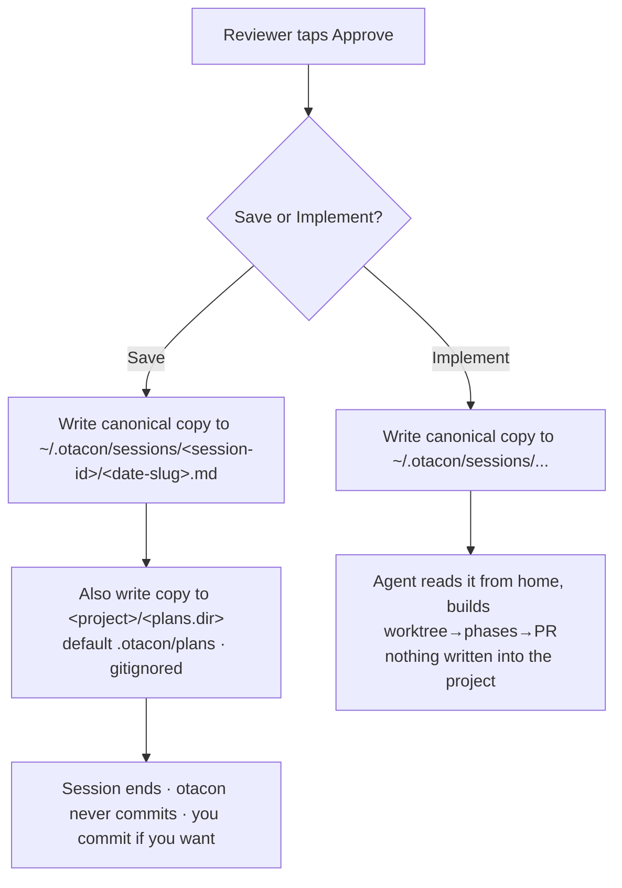

## Summary



Make otacon land softly in any repo: approved plans default to a **home** archive
(`~/.otacon/sessions/`), otacon **never commits** (you control git), the approve action
becomes **Save vs Implement**, and project config follows Claude Code's committed +
`.local` two-tier model so a team can share the save location.

## Contract

```ts
// shared/config.ts — one new schema leaf (auto-renders in Settings UI + `config get`)
interface PlansConfig { dir: string }              // default ".otacon/plans" (repo-relative)
// CONFIG_SCHEMA += { section:"plans", key:"dir", type:"path", default:".otacon/plans" }

// shared/paths.ts
homeSessionsDir(): string                              // <OTACON_HOME>/sessions
homeSessionDir(id): string                             // <OTACON_HOME>/sessions/<session-id>  (id already unique)
repoConfigPath(repoRoot): string                    // <repo>/.otacon/config.json   (COMMITTED)
repoLocalConfigPath(repoRoot): string               // <repo>/.otacon/config.local.json (gitignored)

// shared/types.ts — approved event (commit field removed; `home` always present)
| { event:"approved"; session; path; home; implement?: true }
//   Save:      path = repo-relative project copy ;  home = abs ~/.otacon/sessions/... copy
//   Implement: path = home = abs ~/.otacon/sessions/... ; agent builds from it

// loadConfig precedence:  defaults ← user ← project(.otacon/config.json) ← project.local
// POST /api/config scope:  "user" | "project" | "project.local"
```

## Decisions

- D1: Default zero footprint — every approved plan lands in the home archive `~/.otacon/sessions/`, nothing enters the target repo unless the reviewer picks Save ← q1, q9
- D2: Approve becomes **Save vs Implement**; otacon **never git-commits** a plan — it only chooses *where the file is written*; the user commits manually ← q7, q8
- D3: Home is the canonical store for *all* plans; **Save** additionally copies into `<project>/<plans.dir>`; **Implement** keeps it in home only and builds from there ← q9
- D4: Drop the `commit` knob and every `git check-ignore` path — no commit means no ignore check ← q7, q8
- D5: Project config goes two-tier: committed `.otacon/config.json` + gitignored `.otacon/config.local.json`, precedence user < project < project.local (Claude Code parity) ← q6, q10
- D6: Home plans keyed by the globally-unique session id — `~/.otacon/sessions/<session-id>/<date>-<slug>.md`, reusing the existing per-session structure; no repo namespacing needed ← q11, t1
- D7: `plans.dir` is a single `CONFIG_SCHEMA` path leaf (default `.otacon/plans`), so the Settings UI + `otacon config get plans.dir` pick it up for free ← q6, q7
- D8: Implement loop reads the plan from the event's home `path`; the `git mv → docs/plans/archive/` step is removed (no committed plan to archive) ← q2, q9
- D9: This repo (otacon) stays zero-footprint — no committed `.otacon/config.json` pinning a tracked plans dir ← q4
- D10: Revises #11's "repo config is gitignored" decision; the `.otacon/` ignore changes to keep `config.json` tracked ← q10 [DECISIONS revisit]

> [!decision]
> Claude Code does **not** persist plans to `~/.claude/plans` (no plan-store
> exists there); we adopt its *config* two-tier pattern, and add the home plan
> archive as otacon's own idea.

## Impact

Upstream this leans on: the schema-driven config (`CONFIG_SCHEMA`, `loadConfig`,
`coerceFieldValue`), the approve endpoint + `composeArtifact`/`pickArtifactRelPath`,
the `approved` event contract, and the `start.ts` gitignore append.

Downstream it can break: the **agent skill protocol** (the `approved`/implement
handlers — they must stop committing), the **Settings UI** (gains a third scope),
the **approve dialog** (renamed actions), and existing repos whose `.gitignore` has a
blanket `.otacon/` line (migration). `otacon clean`/archival must leave the home
store untouched.

## Phases

### Phase 1 — Config two-tier + gitignore

Goal: Project config becomes committed `.otacon/config.json` with a gitignored
`.otacon/config.local.json` override; precedence `user < project < project.local`.
The `.otacon/` ignore keeps `config.json` tracked.

Files:
- `src/shared/paths.ts` — add `repoConfigPath` (committed) + keep `repoLocalConfigPath` for `config.local.json`
- `src/shared/config.ts` — `loadConfig` overlays user → project → project.local
- `src/daemon/app.ts` — `/api/config` GET+POST accept `scope: "project.local"`
- `src/cli/commands/start.ts` — fresh repos get `.otacon/*` + `!.otacon/config.json` (no upgrade of existing ignores)
- `DESIGN.md` §16, `DECISIONS.md` (revise #11)
- co-located `*.test.ts` for each

Verification: precedence covered by unit tests; `otacon start` in a fresh repo writes
the selective ignore so `config.json` is trackable.
```gwt
Given user, project, and project.local all set plans.dir
When loadConfig resolves
Then project.local wins, then project, then user, then the schema default
```

#### Details
A fresh repo gets `.otacon/*` + `!.otacon/config.json`; `config.local.json` stays
ignored by the `.otacon/*` glob. No upgrade path for repos with a pre-existing blanket
`.otacon/` line — pre-release, there are none to migrate (t2). `realpathOr`/
`findRepoRoot` already exist for repo resolution.

### Phase 2 — Settings UI: project.local scope

Goal: The Settings screen gains a third scope (User / Project / Project · local) with
a `user < project < project.local` inheritance display; `plans.dir` (added in Phase 3)
needs no UI code — it renders from the schema.

Files:
- `src/ui/settings.ts` — `inheritedValue` walks the 3-scope chain
- `src/ui/settings-screen.tsx` — scope selector third option, "inherits from project" hints
- `src/ui/api.ts` — `getConfig`/`postConfig` carry `project.local`
- co-located `*.test.ts`, `test/ui/settings.e2e.ts`

Verification: settings unit tests assert the 3-scope inheritance; e2e saves a
project.local override and sees it win over project.
```gwt
Given the Settings screen on Project · local scope with Project overriding plans.dir
When the field is left unset
Then it shows the Project value as the inherited placeholder, not the schema default
```

### Phase 3 — Home plan store + Save/Implement approve + agent protocol

Goal: Add the `plans.dir` schema leaf; the daemon writes every approved plan to the
namespaced home store, and on **Save** also into `<project>/<plans.dir>`; **Implement**
builds from the home copy. Drop commit + archive end-to-end (daemon event + skill card).

Files:
- `src/shared/config.ts` — `PlansConfig`/`plans.dir` in `DEFAULT_CONFIG` + `CONFIG_SCHEMA`
- `src/shared/paths.ts` — `homeSessionsDir`/`homeSessionDir`
- `src/shared/types.ts` — `approved` event: drop commit assumptions, add `home`
- `src/daemon/approve.ts` — pick home + project paths; compose once, write both on Save
- `src/daemon/app.ts` — approve endpoint writes home (+project on Save), sets event paths
- `src/cli/install/assets.ts` — protocol card: Save vs Implement, no `git add/commit`, implement reads `path` (home), no archive `git mv`
- `.claude/skills/otacon/SKILL.md` — regenerate from `dogfoodSkillMd()`
- `DESIGN.md` §6/§12, `DECISIONS.md`; co-located `*.test.ts` + `assets.test.ts`

Verification: approve.test + app.test cover home-only (Implement) vs home+project
(Save); `assets.test.ts` guards the regenerated dogfood file.
```gwt
Given a reviewer taps Save
When the daemon finalizes
Then the plan exists at ~/.otacon/sessions/<session-id>/<date-slug>.md AND <project>/.otacon/plans/<date-slug>.md, the event carries both paths, and no git command runs

Given a reviewer taps Implement
When the daemon finalizes
Then the plan exists only under ~/.otacon/sessions, the event path points there with implement:true, and nothing is written into the project
```

#### Details
`homeSessionDir` = `join(homeSessionsDir(), id)` — the session id is already a unique
hash, so it mirrors `.otacon/<id>/` and never collides across repos (no name suffix
needed in home; the project copy keeps the collision-suffix loop). The CLI
implement loop already reads phases from a path; only the source path (home, absolute)
and the removed archive step change. `composeArtifact` is unchanged.

### Phase 4 — Approve dialog: Save vs Implement

Goal: The confirm sheet's two actions read **Save Plan** and **Implement**, the copy
names the real destinations (home archive always; project copy on Save), and no copy
claims a commit.

Files:
- `src/ui/review/approve.tsx` — relabel actions + honest destination copy; `ApprovedNote` shows home + project paths
- `src/ui/api.ts` — `postApprove` result carries `home`
- co-located `*.test.ts`

Verification: component test asserts the two labels and that neither path/copy mentions
committing; the post-approve note renders both destinations.

## Risks

> [!risk]
> Phase 3 is the heavy one (daemon + event + skill card together). If it crosses the
> ~300-LOC guide, split at the daemon/protocol boundary — but they must land paired so
> the skill never tells the agent to commit a file the daemon no longer expects.

- [breaking] The `approved` event loses its commit semantics; an installed *old* skill would still try `git add` — harmless (manual-commit parity), resolved on reinstall.
- DESIGN.md's core "approved plan committed to docs/plans is the contract" narrative (#7, #13, §12) needs real rewriting, not a tweak.
- `otacon clean` / session archival must never touch `~/.otacon/sessions` (permanent archive).

## Open Questions

- None blocking. Phase 3's daemon/protocol split is an implementation call left to build time (see Risk 1).

## Interview

### q1 — Core model: how should 'where the plan lives' and 'whether it's committed' relate? The daemon ALWAYS writes the approved artifact to disk; the only question is the default location + whether the agent git-commits it. Which default best serves 'easy integration into other repos'?

- Options: A: default dir=.otacon/plans (gitignored, zero git footprint) + commit=false; opt into committed contract via dir=docs/plans + commit=true (recommended) | B: dir + commit fully independent, dir defaults to docs/plans, commit defaults false (leaves an UNTRACKED file in docs/plans) | C: single mode enum (gitignored | committed) instead of two separate knobs
- Answer: A: default dir=.otacon/plans (gitignored, zero git footprint) + commit=false; opt into committed contract via dir=docs/plans + commit=true

### q2 — Approve & Implement with the new default (onImplement=false, no hosted plan doc): the implement loop currently reads phases from the COMMITTED plan and ends by 'git mv docs/plans/<x>.md -> docs/plans/archive/' so the doc rides in the PR. With no hosted doc, what should happen?

- Options: A: daemon still composes the approved artifact but writes it ONLY to .otacon/<id>/approved.md (gitignored); implement loop reads phases from there; skip the commit + the docs/plans/archive move; PR carries no plan doc. Set onImplement=true to host+commit+archive it as today (recommended) | B: don't compose any artifact at all when onImplement=false; implement loop reads phases from the working plan.md it already drafted
- Answer: A: daemon still composes the approved artifact but writes it ONLY to .otacon/<id>/approved.md (gitignored); implement loop reads phases from there; skip the commit + the docs/plans/archive move; PR carries no plan doc. Set onImplement=true to host+commit+archive it as today

### q3 — Config shape for the new knobs — a new `plans` section in otacon.config.json (global ~/.otacon/config.json + repo override), mirroring the existing budgets/activity/notifications sections. Key names?

- Options: plans.dir / plans.commit / plans.onImplement (recommended) | plans.dir / plans.commit / plans.implementDoc | artifact.dir / artifact.commit / artifact.onImplement
- Answer: there is a major refactor of config json. pull latest main, look at the changes, and rephrase your questions

### q4 — This repo dogfoods otacon and wants its OWN plans to keep landing committed in docs/plans/. Add a committed otacon.config.json at the repo root here with plans.dir=docs/plans + plans.commit=true (onImplement stays default false)?

- Options: Yes — add otacon.config.json so this repo keeps committing to docs/plans (recommended) | No — let this repo also go zero-footprint (.otacon/plans, uncommitted)
- Answer: No — let this repo also go zero-footprint (.otacon/plans, uncommitted)

### q5 — Footgun guard: if a user sets commit=true but the resolved plan dir is gitignored (e.g. left under .otacon/), the agent's `git add` would fail/no-op. How should the daemon handle it?

- Options: Daemon runs `git check-ignore` on the artifact path; if commit was requested but the path is gitignored, downgrade the `approved` event to commit=false with a stderr notice (recommended) | Trust the config verbatim (event carries commit=true regardless); just document the footgun and list it in the plan's Risks
- Answer: daemon runs git check-ignore is a great idea. in the settings UI, we need to make sure only none ignored path can be set. also, in the web UI, we need to show a warning in the approval dialog that if commit is set to true and the moment before the approval, the path is ignored and commit won't be possible.

### q6 — Re-framed for the new schema-driven config. Add three leaves to CONFIG_SCHEMA so the Settings UI + `otacon config get` pick them up automatically (mirroring worktree.dir): plans.dir (type path, default ".otacon/plans"), plans.commit (type bool, default false), plans.onImplement (type bool, default false = don't host a plan doc when implementing in the same session). Confirm key names — especially the third?

- Options: plans.dir / plans.commit / plans.onImplement (recommended) | plans.dir / plans.commit / plans.implementDoc | plans.dir / plans.commit / plans.commitOnImplement
- Answer: Let's think this through, we need to follow what claude code does. In claude code, the plan file always live in ~/.claude/plans folder, and the config file in <project>/.claude/ are not gitignored. this is a very smart way to deal with this. And there is a way to add local claude config that we can add to gitignore. We should follow the exact same format.

### q7 — Settings UI rule for the commit-vs-gitignore conflict. The DEFAULT plans.dir (.otacon/plans) is gitignored, so 'only a non-ignored path' must be CONDITIONAL: a gitignored dir is only invalid when plans.commit=true (you can't git-commit an ignored path). How strict at save time?

- Options: Block save with a 422 field error when commit=true AND the dir is gitignored (UI shows it inline next to the field) (recommended) | Allow the save but show an inline warning only; let commit downgrade later at approve time
- Answer: I changed my mind. Here's how things should work. In the UI, we should ask whether user wants to save the plan or implement the plan. If the choice is save the plan, we move the approved plan to the <project>/.otacon/plans folder. If implement, we use the approved plan in ~/.otacon/plans to guide the implementation. No need to configure whether to commit, user will control the commit behavior themselves. Otacon only cares about where the plan is saved. The custom plan saved location should be a project-specific param.

### q8 — Approve-time fallback when commit was configured true but the resolved dir is gitignored at the moment of approval (e.g. .gitignore changed after settings were saved, so the settings-time block couldn't catch it). What happens?

- Options: Proceed: write the artifact, downgrade the event to commit=false, and show a warning in the approval dialog that commit isn't possible (path is gitignored) (recommended) | Block approve with an error until the path is made committable
- Answer: with the answer in q7, we don't care about commit so checking git ignore is no longer needed

### q9 — Lock the revised approve model. The approve dialog offers two choices, and otacon NEVER git-commits (you commit manually). Destination depends on the choice: SAVE -> write the approved plan to <project>/<plans.dir> (default .otacon/plans, gitignored = zero footprint; set plans.dir=docs/plans to make it a tracked file you commit yourself); session ends. IMPLEMENT -> write the approved plan to ~/.otacon/plans (home), build from there (worktree/per-phase/PR); nothing is written into the project and no plan doc rides in the PR. Correct?

- Options: Yes — destination depends on the choice (Save->project plans.dir, Implement->~/.otacon/plans home); otacon never commits, no archive step (recommended) | Almost — always keep the canonical copy in ~/.otacon/plans AND on Save also write it into the project (home stays a global archive of every plan)
- Answer: Almost — always keep the canonical copy in ~/.otacon/plans AND on Save also write it into the project (home stays a global archive of every plan)

### q10 — Config file format. To make plans.dir shareable with a team, the project config must be committable — but the just-landed refactor (#11) made <project>/.otacon/config.json GITIGNORED. Mirror Claude Code's two-tier model instead: committed <project>/.otacon/config.json (team-shared) + gitignored <project>/.otacon/config.local.json (personal), precedence user < project < project.local; adjust the .otacon/ gitignore so config.json stays tracked. Include this in THIS plan?

- Options: Yes — revise repo config to committed config.json + gitignored config.local.json (Claude Code two-tier) as part of this plan (recommended) | No — keep #11's single gitignored .otacon/config.json; ship only the plans-location + Save/Implement change now and split config-format into a separate plan
- Answer: Yes — revise repo config to committed config.json + gitignored config.local.json (Claude Code two-tier) as part of this plan

### q11 — Home plan store layout. Implement-mode plans (and any global archive) live under ~/.otacon/plans across MANY repos. How to keep them from colliding/mixing?

- Options: Namespace per repo: ~/.otacon/plans/<repo-basename>-<short-hash>/<date>-<slug>.md (recommended) | Flat ~/.otacon/plans/<date>-<slug>.md with a numeric suffix on name collisions
- Answer: Namespace per repo: ~/.otacon/plans/<repo-basename>-<short-hash>/<date>-<slug>.md

### q12 — Approve & Implement is on, but the build base is ambiguous. The plan was designed against origin/main (691bf64 = the config refactor: CONFIG_SCHEMA, repoLocalConfigPath, Settings UI) — but your LOCAL main (d5bed16) has DIVERGED from it (not a fast-forward), plus you have 3 other in-flight impl worktrees and uncommitted changes (TODOs.md, some docs/plans deletions, .vscode). Building on local main would fail (the refactor's files don't exist there). How should I base the implementation?

- Options: Base the impl worktree on origin/main (691bf64); leave my local main + uncommitted changes untouched; PR targets main (recommended) | Abort the build now — I'll reconcile main with origin/main myself, then re-run Approve & Implement | Pause and wait for my written guidance
- Answer: origin/main and main are not aligned. go ahead
