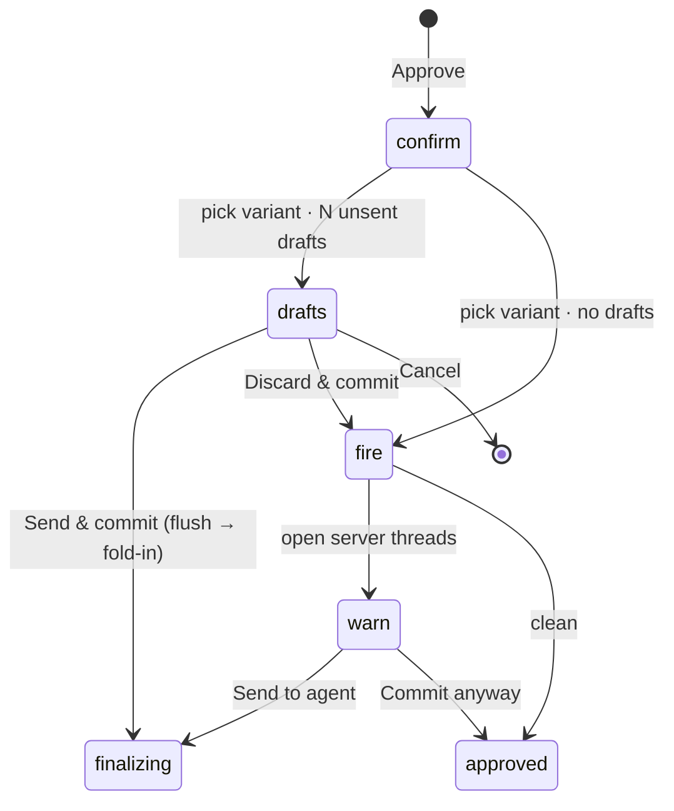

## Summary



Staged drawer comments live only in the browser until **Send all**, so today Approve
(a server-side check) can't see them and they vanish silently. Add a client-side
**drafts gate**: choosing a commit variant with N unsent drafts opens a `Send & commit ·
Discard & commit · Cancel` stage — Send flushes and folds them in via the existing
comment-and-approve path in one click, Discard drops them. A `beforeunload` guard also catches reload/close-tab.

## Contract

```ts
// ApproveDialog gains three props; the drawer state stays in ReviewLoop.
pendingCount: number                  // unsent drawer drafts (browser-only)
onFlushDrafts: () => Promise<boolean>  // POST the batch; true on success
onDiscardDrafts: () => void            // clear the local drafts
// new Stage: { kind: "drafts" }; entered when a variant is picked && pendingCount > 0
```

## Decisions

- D1: Approve intercepts before finalize when drawer drafts are unsent — a drafts stage (Send & commit / Discard & commit / Cancel), never a silent drop ← q1
- D2: Send & commit flushes the drafts then finalizes through the existing comment-and-approve fold-in (`sendOpenComments`) in one click — no redundant second warn ← q4
- D3: The drafts stage fires *after* the variant pick, reusing the `pendingImplement` carry, so Send/Discard inherit Commit Plan vs Commit & Implement ← q1, q4
- D4: A `beforeunload` guard covers reload/close-tab only; navigate-away and composer half-typed text stay out of scope ← q2
- D5: The guard is client-only — the daemon never sees browser-local drafts, so no API or protocol change [assumed]

| Pick | Send-first finalizes by                  | Tradeoff                                    |
| ---- | ---------------------------------------- | ------------------------------------------- |
| ✓    | One click: flush + agent fold-in + commit | matches "these should count"; no double warn |
|      | Flush, then the normal unresolved warn    | extra clicks; reuses the warn stage as-is    |

## Impact

The change is confined to the review SPA. It leans on two existing daemon paths
unchanged: `POST /comments` (the flush) and `POST /approve {sendOpenComments}` (the
comment-and-approve fold-in, DESIGN.md §12). `ApproveDialog` grows one leading stage
and three props; `ReviewLoop` wires the drawer's `pending`/`sendAll` to them and owns
the `beforeunload` listener. Nothing else consumes `ApproveDialog`, so blast radius is
the approve sheet plus the unload guard — no server, CLI, or schema surface moves.

## Phases

### Phase 1 — Approve drafts gate

Goal: when a commit variant is picked with unsent drawer drafts, enter a `drafts`
stage instead of finalizing. Send & commit flushes then fires `{sendOpenComments,
implement}`; Discard & commit clears the drafts then fires `{implement}`; Cancel closes.

Files:
- `src/ui/review/approve.tsx` — new `drafts` Stage, props, gated fire
- `src/ui/session-screen.tsx` — pass `pendingCount` + flush/discard callbacks
- `src/ui/review/approve.test.ts` *(new)* — stage-transition unit coverage if a pure helper is extracted
- `DESIGN.md` §10/§12 · `DECISIONS.md` — record the gate + D2/D3

Verification: `bun test` · `bun run typecheck` · `bun run build`; manual `bun run verify:branch full` to click the sheet. Unit-test any extracted pure stage helper.

```gwt
Given 2 comments staged in the drawer, never sent
When the reviewer clicks Approve and picks Commit Plan
Then a drafts stage offers Send & commit, Discard & commit, Cancel
And no finalize has fired yet

Given the drafts stage is open
When the reviewer clicks Send & commit
Then the staged comments flush and the session goes finalizing (agent folds them in)

Given the drafts stage is open
When the reviewer clicks Discard & commit
Then the local drafts clear and the plan finalizes with the chosen variant
```

### Phase 2 — Reload / close-tab guard

Goal: while `pending.length > 0`, register a `beforeunload` handler so the browser
warns before a reload or tab close discards the staged drafts; remove it the moment the
drawer empties (sent or deleted), so a clean session never prompts.

Files:
- `src/ui/session-screen.tsx` — `beforeunload` effect gated on `pending.length`
- `DESIGN.md` §10 — note the unload guard scope (reload/close only)

Verification: `bun test` · `bun run typecheck` · `bun run build`; manual reload with/without staged drafts.

```gwt
Given comments staged in the drawer, never sent
When the reviewer reloads or closes the tab
Then the browser warns before the page unloads

Given the drawer has no unsent drafts
When the reviewer reloads
Then no warning appears
```

## Risks

> [!risk]
> `beforeunload` copy is browser-controlled and the prompt fires on every unload —
> scoping strictly to `pending.length > 0` is what keeps it from nagging a clean session.

> [!risk]
> If the flush succeeds but `postApprove` then fails, the drafts are now real threads
> (not lost); the sheet must surface the approve error so the reviewer can retry, not strand them.

- A draft stacked while the flush POST is in flight must not be silently dropped — reuse `sendAll`'s "remove exactly what was sent" set so a late draft stays pending.
- Discard & commit is effectively irreversible (local drafts gone); the button copy must say it drops them, and Cancel must be the safe default.

## Open Questions

None blocking. Composer half-typed text and in-app navigation were explicitly scoped
out (q2); revisit a `localStorage` draft-persistence approach only if drafts ever grow
long-lived enough that a reload warning feels too weak.

## Interview

### q1 — You hit Approve with N comments staged in the drawer but never sent (browser-only drafts the daemon never received). Today Approve ignores them and they vanish when the session ends. What should happen? (I recommend the confirm sheet: 'Send first' flushes them — which then routes into the existing send-to-agent fold-in — so nothing is lost by accident, and Discard stays explicit.)

- Options: Confirm sheet: Send first / Discard & approve / Cancel (recommended) | Auto-send the staged batch as the approve fold-in, no prompt | Block Approve until the drawer is empty (send or delete each)
- Answer: Confirm sheet: Send first / Discard & approve / Cancel

### q2 — Besides the Approve gate, which other silent-loss moments should also warn before dropping unsent drafts? (I recommend at least reload/close-tab and navigate-away — both wipe the drawer's React state today with zero warning. Composer half-typed text is lower value since it's one field you can see.)

- Options (multi): Reload or close the tab (recommended) | Navigate away (home / switch session) | Close the composer with half-typed text
- Answer: Reload or close the tab

### q3 — You picked 'Send first' at approve. Flushing the staged drafts turns them into real OPEN comment threads on the daemon. How should it finalize from there? (I recommend reusing the existing machinery: flush, then drop into the normal approve, which already offers 'Send to agent' fold-in vs 'Commit anyway' for open threads. The alternative is a one-shot button that always folds in via the agent and commits, fewer clicks but pre-decides the fold-in.)

- Options: Reuse existing flow: flush, then normal approve handles the now-open comments (recommended) | One-shot: flush + send-to-agent fold-in + commit, no further prompts
- Answer: i don't quite understand the difference between the two options. help me more

### q4 — Re-asking q3 in plain terms. Scenario: you staged 2 comments, never sent them, hit Approve, click 'Send first.' The 2 comments get sent to the agent either way. The ONLY difference is the final commit step. ● Option A (keep the choice): after sending, you land on the normal approve screen; when you commit, otacon notices the 2 comments are unaddressed and asks you — 'Send to agent' (agent revises the plan to address them, then commits) OR 'Commit anyway' (commit now, comments noted but not acted on). You decide at the end. A couple more clicks, but you keep the escape hatch. ● Option B (one click): clicking 'Send first' sends the comments, tells the agent to address them, and commits — no further prompts. Fewer clicks, but it always means 'agent, act on these'; you can't choose 'just commit, ignore them' at that point. In short: A = you still pick act-on-them vs just-commit at the end; B = always acts on them, zero extra clicks.

- Options: A — keep the choice at the end (recommended) | B — one click, agent always addresses them
- Answer: B — one click, agent always addresses them
