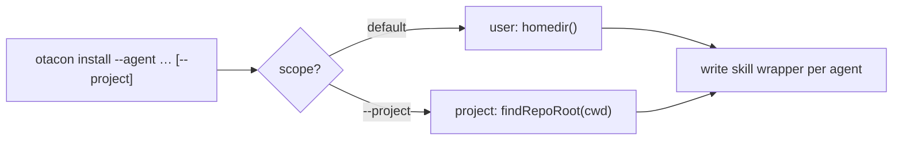
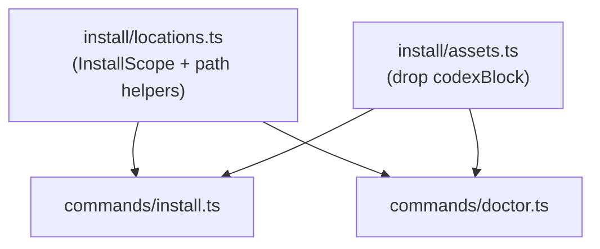

## Summary



Add `otacon install --project` to write the protocol skill wrapper into the **current
git repo** instead of user home — same `--agent`/`--all`, destinations under the repo
root so the wrapper can be committed and shared. Also migrate Codex onto its own skill
folder (`.codex/skills/otacon/SKILL.md`) at both scopes, and teach `otacon doctor` to
see project wrappers.

## Contract

```ts
type InstallScope = { kind: "user" } | { kind: "project"; root: string };

claudeSkillPath(scope): string    // user: ~/.claude/...      project: <root>/.claude/...
codexSkillPath(scope): string     // user: ~/.codex/skills/.. project: <root>/.codex/skills/..  (replaces codexAgentsPath)
opencodeSkillPath(scope): string  // user: ~/.config/opencode/.. project: <root>/.opencode/..
// claudeHookScriptPath()/claudeSettingsPath() stay user-only — hooks are not installed at project scope.
```

`otacon install [--agent … | --all] [--project] [--hooks]` — `--project` resolves the
base to the git repo root (`findRepoRoot`); `--hooks` with `--project` is a usage error.

## Decisions

Destinations by scope (the chosen project layout):

| Agent    | User (unchanged)                         | Project (`--project`)                  |
| -------- | ---------------------------------------- | -------------------------------------- |
| claude   | `~/.claude/skills/otacon/SKILL.md`       | `<root>/.claude/skills/otacon/SKILL.md`|
| codex    | `~/.codex/skills/otacon/SKILL.md` [new]  | `<root>/.codex/skills/otacon/SKILL.md` |
| opencode | `~/.config/opencode/skills/otacon/SKILL.md` | `<root>/.opencode/skills/otacon/SKILL.md` |

- D1: `--project` base = `findRepoRoot(cwd)`; hard error (exit 2) when cwd isn't in a git repo. ← q1
- D2: All three agents at project scope, per the table above. ← q2
- D3: Codex moves to a `SKILL.md` skill folder at **both** scopes; the `AGENTS.md` marker block is fully deleted — no migration/cleanup, it was never shipped/used. ← q2, q5, t1
- D4: Stop hook is **not** installed at project scope; `--hooks --project` is rejected. ← q3
- D5: `otacon doctor` reports project wrappers when run inside a repo, with clearer "skill not installed" wording. ← q4

> [!decision]
> Deferring the project Stop hook is what keeps a committed `.claude/` fail-safe: a
> teammate without otacon installed inherits only an inert skill file (the agent acts
> on it solely when they invoke otacon), never a turn-blocking hook pointing at a
> missing script. ← q3

## Impact



- `locations.ts` is the hinge — both `install` and `doctor` consume its path helpers.
- Codex migration deletes `codexBlock()` + the `AGENTS.md` upsert path; no installed-base
  impact — the marker-block install was never shipped/used [t1].

## Phases

### Phase 1 — Scope-aware locations + Codex skill migration

Goal: Make the three skill-path helpers scope-aware via `InstallScope`. Migrate Codex
(both scopes) to `.codex/skills/otacon/SKILL.md` via `skillMd()`, fully deleting the
`AGENTS.md` marker-block path; call sites pass user scope.

Files:
- `src/cli/install/locations.ts` (+ `locations.test.ts`) — add `InstallScope`, scope-aware paths, drop `upsertMarkedBlock`
- `src/cli/install/assets.ts` (+ `assets.test.ts`) — delete `codexBlock()`, `CODEX_BEGIN`, `CODEX_END`
- `src/cli/commands/install.ts` — codex case writes `skillMd()` to `codexSkillPath({kind:"user"})`
- `src/cli/commands/doctor.ts` — codex check uses `codexSkillPath` + `MANAGED_MARKER`
- `DESIGN.md` §16, `DECISIONS.md`

Verification: `bun test`, `bun run typecheck`. `otacon install --agent codex` writes
`~/.codex/skills/otacon/SKILL.md` with the protocol card; doctor's codex check passes
against the new path.

```gwt
Given a clean home dir
When the user runs otacon install --agent codex
Then ~/.codex/skills/otacon/SKILL.md exists with the protocol card
And otacon doctor reports the codex wrapper as ok
```

#### Details

`InstallScope = {kind:"user"} | {kind:"project"; root}`. Helpers branch on `kind`:
user uses `homedir()`/`$CODEX_HOME`/`$XDG_CONFIG_HOME` (today's logic); project uses
`<root>/.claude`, `<root>/.codex/skills`, `<root>/.opencode/skills`. With Codex off the
marker block, `upsertMarkedBlock` + the `CODEX_BEGIN/END` markers are now dead and are
deleted in this phase.

### Phase 2 — `otacon install --project`

Goal: Wire the `--project` flag through `installCommand`: resolve the repo root, build a
project scope, pass it to `installAgent`. Reject `--hooks --project`.

Files:
- `src/cli/commands/install.ts` (+ `install.test.ts` if present, else cover via locations/e2e)
- `DESIGN.md` §16, `DECISIONS.md`

Verification: `bun test`, `bun run typecheck`, `bun run build`. `--project` writes under
the repo root for each selected agent; outside a repo it exits 2 with a clear message;
`--hooks --project` exits 2.

```gwt
Given a cwd inside a git repo
When the user runs otacon install --all --project
Then SKILL.md wrappers are written under <root>/.claude, <root>/.codex/skills, <root>/.opencode

Given a cwd that is not in a git repo
When the user runs otacon install --agent claude --project
Then it exits 2 explaining --project needs a git repo
```

### Phase 3 — doctor project-awareness + wording

Goal: When `otacon doctor` runs inside a repo, also check the project wrapper paths and
report whichever scope is present; reword "wrapper not installed" to name the otacon
skill clearly.

Files:
- `src/cli/commands/doctor.ts` (+ `doctor.test.ts` if present)
- `DESIGN.md` §16

Verification: `bun test`, `bun run typecheck`. In a repo with a project install, doctor
shows the wrapper as `ok` (project path) instead of warning; message names the skill.

```gwt
Given a repo where otacon install --agent claude --project has run
When the user runs otacon doctor in that repo
Then the claude wrapper check is ok and cites the project .claude path
```

## Risks

- Running `--project` in otacon's own repo would clobber the generated dogfood
  `.claude/skills/otacon/SKILL.md`; the `assets.test.ts` drift guard catches it (out of scope).

## Open Questions

- None. OpenCode project path `.opencode/skills/` confirmed online (q7); OpenCode also
  scans `.claude/skills/` + `.agents/skills/`, so the claude wrapper is picked up there too.

## Interview

### q1 — What flag shape should select project-scope install? `--project` resolves to the current git repo root (errors if cwd isn't in a repo). `--dir <path>` takes an explicit base dir. Recommend `--project` — it matches your literal ask ('the current project') and reuses findRepoRoot; --dir adds surface for a rarer case.

- Options: --project (repo root) (recommended) | --dir <path> | Both flags
- Answer: --project (repo root)

### q2 — Which agents should project-install support? Project conventions differ per agent: claude -> <root>/.claude/skills/otacon/SKILL.md; codex -> <root>/AGENTS.md marker block (repo root, NOT .codex/); opencode -> <root>/.opencode/skills/otacon/SKILL.md. Recommend all three for parity, but it means encoding the per-agent project targets (codex/opencode diverge from the homedir layout).

- Options: All three (claude/codex/opencode) (recommended) | Claude only (others stay user-level)
- Answer: all three. codex has its own skill folder .codex/, do not use marker block

### q3 — How should `--hooks` behave at project scope? It writes the Stop hook to <root>/.claude/hooks/otacon-stop.sh and registers it in <root>/.claude/settings.json. The command path can be portable (`$CLAUDE_PROJECT_DIR/.claude/hooks/otacon-stop.sh`, survives commit + teammates) or absolute (breaks if shared). Or defer project hooks entirely. Recommend portable so a committed .claude/ Just Works for the team.

- Options: Support, portable ($CLAUDE_PROJECT_DIR) (recommended) | Support, absolute path | Defer (error on --hooks --project)
- Answer: if it is committed but the other teammates don't have otacon installed, can we make it fall safe? also, we don't have data showing that the stop hook is a must have, i would ignore it for now

### q4 — Should `otacon doctor` also check project-level wrappers when run inside a repo? Today it only checks ~/. After a project install, doctor would wrongly warn 'wrapper not installed'. Recommend teaching doctor to also report project wrappers (present in repo) so it doesn't cry wolf — small addition, prevents a confusing UX.

- Options: Include project checks now (recommended) | Defer to a follow-up PR
- Answer: include project checks now, although, what does it mean by wrapper not installed

### q5 — You noted Codex now has its own skill folder (.codex/). Two things: (a) confirm the project target path is <root>/.codex/skills/otacon/SKILL.md (same SKILL.md format as claude/opencode); (b) should USER-level codex install ALSO migrate from the ~/.codex/AGENTS.md marker block to ~/.codex/skills/otacon/SKILL.md, or stay as-is? Recommend: project uses .codex/skills/, keep user-level AGENTS.md untouched (smaller, focused PR; user-level migration is a separate decision).

- Options: Project uses .codex/skills/; keep user-level AGENTS.md as-is (recommended) | Migrate BOTH user + project codex to .codex/skills/
- Answer: Migrate BOTH user + project codex to .codex/skills/
