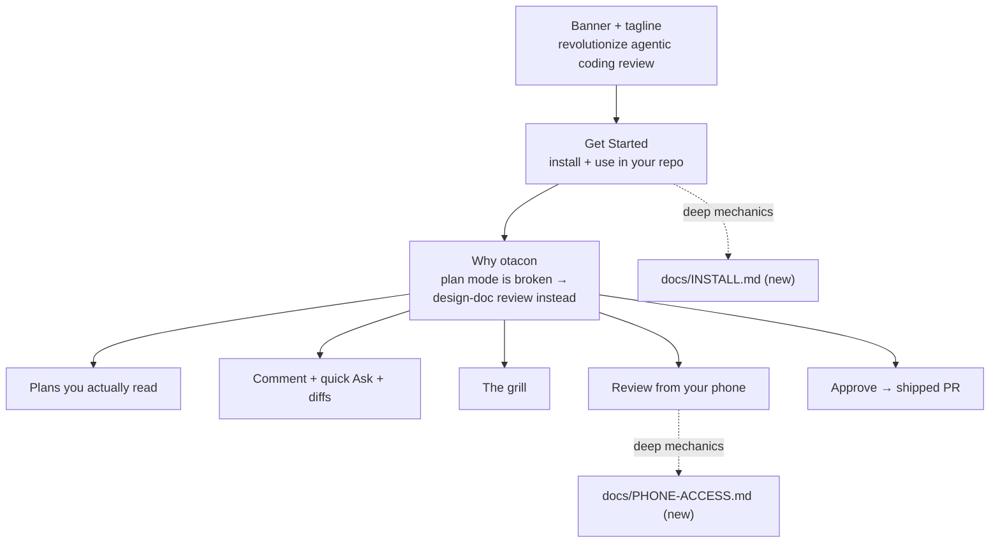

## Summary

Rewrite `README.md` as a value-prop-forward front door: an ambitious "revolutionize
agentic coding review" tagline, a copy-pasteable **Get Started** (install + in-repo
usage), then feature sections framed as *native plan mode is broken — here's the
design-doc-review experience instead*, ending on phone review and Approve & Implement.
Deep install/phone mechanics move out to two new user-facing docs to stay scannable.



## Decisions

- D1: Full ambitious positioning — drop the "personal tool by/for Zero" note *and* any
  humility footer line; reframe zero-API-spend as a privacy/cost *feature* ← q1
- D2: Light codec voice — the tagline plus one tasteful Otacon/codec nod, not voice
  throughout ← q2
- D3: Streamline to the happy path; deep mechanics link *out*, never inline ← q3
- D4: Deep mechanics live in two new user-facing docs — `docs/INSTALL.md`,
  `docs/PHONE-ACCESS.md` (uppercase, matching the repo's root-doc casing);
  DESIGN/DECISIONS/AGENTS stay internal-facing ← q4
- D5: Record the user-facing-vs-internal doc-audience split in `DECISIONS.md` so future
  contributors don't put user mechanics in DESIGN.md (or vice versa) ← q3, q4

| Pick | Positioning option                        | Tradeoff                                              |
| ---- | ----------------------------------------- | ---------------------------------------------------- |
| ✓    | Drop personal-tool note, full ambition    | Cleanest pitch; honesty risk handled in a footer line |
|      | Keep prominent "personal tool by/for Zero" | Honest, but undercuts the "revolutionize" headline   |
|      | Reframe as features only                  | Middle ground the user explicitly rejected            |

## Impact

- **Changed:** `README.md` (full rewrite).
- **New:** `docs/INSTALL.md`, `docs/PHONE-ACCESS.md` (user-facing); `DECISIONS.md` (+1 entry).
- **Cross-refs to verify:** `DESIGN.md` line ~7 references "Roadmap in README.md" — confirm
  it still resolves (the current README has no Roadmap section; repoint or leave as-is).
- **No** code, protocol, CLI surface, lint, or storage change → DESIGN.md product spec
  is untouched; this is docs-only `[new]` content reorganization.

## Phases

### Phase 1 — Rewrite README.md

Goal: Replace README with banner + tagline + Get Started (install happy path + the
in-repo review loop) + value-prop feature sections, with deep mechanics linked out.

Files:
- `README.md`

Verification: markdown renders (mermaid + tables); the tagline and a copy-pasteable
install sit above any deep mechanics; every link resolves; codec voice is confined to
the tagline + one nod.

```gwt
Given a developer who has never seen otacon
When they read the top of the new README
Then they hit the tagline, then a copy-pasteable install, then "use it in your repo"
And they never wade through managed-file or Tailscale-cert mechanics on the happy path

Given the feature sections
When the reader scans them
Then each opens with what native plan mode does badly and what otacon does instead
And the design-doc-review heritage, anchored comments, quick Ask, and phone review are all covered
```

#### Details

Proposed README skeleton (informative — elaborates the read path, no new scope):

1. **Banner** — keep the existing masthead image.
2. **Tagline** (one line under banner) — pick from options A/B/C in Open Questions
   (recommend A: the design-doc angle); optional thin-gray subline with proof points.
3. **Badges** — keep npm / node / license.
4. **One-paragraph what-it-is** + the single codec nod (*mission support over codec —
   Snake's in the field, otacon's on the line*).
5. **## Get started**
   - *Install* — the 4-line happy path (`npm i -g otacon`, `otacon install`,
     `otacon doctor`), then "Full options → [docs/INSTALL.md]".
   - *Use it in your repo* — the loop a developer actually runs: the agent calls
     `otacon start`, opens the review URL, grills you, drafts, you review & approve.
     One short numbered walkthrough; link the protocol detail out.
6. **## Why otacon** — the narrative spine. Native plan mode fails four ways (wall of
   text → rubber-stamping; unanchored feedback, no diff; text-only; one long session
   degrades). Tech companies don't ship from a wall of terminal text — they review a
   **design doc**: inline comments, a real review pass, sign-off before building.
   otacon brings that to agents. Then feature sub-sections:
   - **Plans you actually read** — schema'd, concise, lead diagram, visuals (callouts,
     decision matrix, GWT/test-driven review), deterministic lint keeps them honest.
   - **Comment, don't rubber-stamp** — anchored inline comments (W3C-style quote+section),
     batched into one clean revision, **quick Ask** (instant Q&A, plan untouched),
     revision **diffs vs what you last reviewed** + changelog.
   - **The grill** — mandatory interview before any plan reaches review; every decision
     traces to the answer that produced it. The design-doc-review heritage, made structural.
   - **Review from your phone** — over Tailscale, one thumb, 5 minutes before you hit the
     road. Plans never leave your devices. Link deep setup → [docs/PHONE-ACCESS.md].
   - **From approved plan to shipped PR** — Approve & Implement walks the phases with
     fresh per-phase subagents and opens a PR.
   - **Private & free by construction** — zero API spend (the daemon never calls a model;
     all intelligence runs in your existing agent session); local-first.
7. **Footer** — no humility line (D1). Just contributor pointers: internal docs
   (DESIGN/DECISIONS/AGENTS) + RELEASING.md, kept clearly separate from the user-facing
   `docs/`.

### Phase 2 — Extract deep mechanics into user-facing docs + record the split

Goal: Create `docs/INSTALL.md` and `docs/PHONE-ACCESS.md` from the current README's deep
content (preserved + lightly expanded), and add a `DECISIONS.md` entry for the
user-facing-vs-internal doc-audience split.

Files:
- `docs/INSTALL.md` (new)
- `docs/PHONE-ACCESS.md` (new)
- `DECISIONS.md`

Verification: every deep mechanic from today's README survives in the new docs (nothing
silently dropped); README links resolve to them; the DECISIONS entry is present.

```gwt
Given today's README's deep mechanics (managed files, --hooks, doctor, build-from-source, Tailscale cert, MAS PATH launcher, expose)
When the new docs are written
Then each mechanic appears in docs/INSTALL.md or docs/PHONE-ACCESS.md
And the README links that replaced them resolve to the right doc

Given DECISIONS.md
When this change lands
Then a new entry records that README + docs/ are user-facing and DESIGN/DECISIONS/AGENTS are internal
And it cites q3, q4
```

#### Details

`docs/INSTALL.md` absorbs: the managed-file write locations + overwrite/marker semantics,
`--all`/`--agent`/`--hooks`, `otacon doctor`, per-repo `.otacon/` + `docs/plans/`,
updating, and the **Build from source (contributors)** block incl. the "github: install
is unsupported" note.

`docs/PHONE-ACCESS.md` absorbs: the full Tailscale walkthrough (install, `tailscale up`,
the **one manual step** — enable HTTPS certs / MagicDNS), `otacon expose` + `verified`
semantics, the `caffeinate -i` reminder, and the Mac App Store `PATH` launcher caveat.

`DECISIONS.md` entry (Decision / Why / Revisit when): doc audience split — README + `docs/`
are the user-facing surface; DESIGN.md / DECISIONS.md / AGENTS.md are internal. *Why:* a
"revolutionize" README shouldn't route users into an internal product spec; deep how-tos
need a user home. *Revisit when:* a docs site or generated reference replaces hand-written `docs/`.

## Risks

> [!risk]
> Full ambition with no humility line (D1) can overstate maturity for a 0.1.x tool —
> mitigate by anchoring the tagline to concrete, verifiable proof (anchored comments,
> phone review, zero API spend), so the pitch is bold but earns it.

- A "revolutionize" tagline can read as hype; anchor it with one concrete proof line
  (anchored comments + phone review + zero API spend) right beside it.
- Moving mechanics out risks dropping a detail or breaking a link — Phase 2 does a
  line-by-line preservation check against the current README.
- `DESIGN.md`↔`README.md` cross-references (the Roadmap pointer) could go stale.

## Open Questions

- **Tagline pick** (only open item). Options:
  - **A** *(recommend)* — "Revolutionize agentic coding review — give your agent's plans the design-doc review they deserve."
  - **B** — "Stop rubber-stamping your agent's plans. Revolutionize agentic coding review with concise, anchored, reviewable plans — from your desk or your phone."
  - **C** — "Mission support for your coding agent. Revolutionize agentic coding review: schema'd plans, inline comments, and sign-off on any device."
  - Or a two-liner: A as the bold tagline + a thin-gray subline with B's proof points (anchored comments · phone review · zero API spend).

## Interview

### q1 — The brief wants an ambitious 'revolutionize agentic coding review' one-liner, but today's README leads with 'Personal tool by/for Zero. Zero API spend by construction.' How should the new README position that honesty?

- Options: Reframe as features, footer disclaimer (recommended) | Keep prominent personal-tool framing | Drop personal-tool note entirely
- Answer: Drop personal-tool note entirely

### q2 — Otacon has a strong Metal Gear Solid codec identity ('mission support over codec', Snake/Otacon, lime-green gear wordmark). How much of that voice belongs in the README?

- Options: Light: one tasteful nod + tagline (recommended) | Lean in: codec voice throughout | None: keep it neutral/professional
- Answer: Light: one tasteful nod + tagline

### q3 — Today's README carries dense mechanics inline (managed-file overwrite rules, Tailscale HTTPS-cert caveats, build-from-source, the 'github: install is unsupported' note). For a value-prop-forward rewrite, what happens to that depth?

- Options: Streamline: keep happy path, link deep mechanics to DESIGN.md (recommended) | Preserve all of it inline | Cut deep mechanics entirely
- Answer: Keep happy path, link deep mechanics to other user facing docs, not design.md which is internal facing

### q4 — No user-facing deep-dive docs exist yet (only README + maintainer RELEASING.md; DESIGN/DECISIONS/AGENTS are internal). The deep install mechanics (managed-file overwrite rules, --hooks, doctor) and phone mechanics (Tailscale HTTPS cert, PATH launcher) need a home outside README's happy path. Where should that depth live?

- Options: Two focused user-facing docs: docs/install.md + docs/phone-access.md (recommended) | One combined docs/guide.md | Collapsible <details> blocks inside README (no new files)
- Answer: Two focused user-facing docs: docs/install.md + docs/phone-access.md
