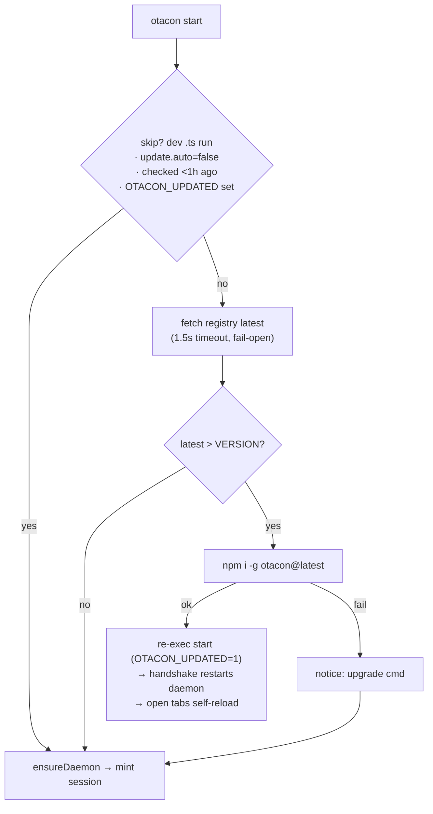
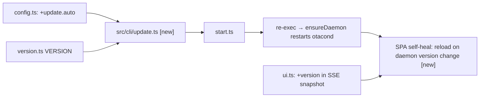

## Summary



`otacon start` gains a pre-session auto-update gate: a newer published version is
fetched, installed via npm, then the command re-execs so the new CLI and (via the
version handshake) the daemon both run new code — any failure degrades to a notice.
Because an update restarts the daemon under open review tabs, the SPA self-heals
too [new]: a tab reloads once on a daemon version change, never running stale JS.

## Contract

```ts
// src/cli/update.ts — called at the very top of startCommand, before ensureDaemon
export async function maybeAutoUpdate(argv: string[]): Promise<void>;
// Returns (proceed with current version) in every non-update path.
// On a successful npm update it re-execs `node main.js start <argv>` with
// OTACON_UPDATED=1 and never returns (process exits with the child's code).
```

> [!note]
> Pure helpers (testable without network or npm): `isNewer(latest, current)`
> semver compare, and `updateCheckDue(cache, nowMs)` (the 1h throttle).

## Decisions

| Pick | Option | Tradeoff |
| ---- | ------ | -------- |
| ✓ | Auto-update + re-exec at start | true auto-update; safe because start is pre-session ← q8 |
|   | Notify-only | industry-majority, lower risk, but not what was asked |

- D1: Auto-update then re-exec, fail-open to a notice; degrade to notice when npm can't write (no sudo) ← q8
- D2: Only `otacon start` runs the check; tight loops (wait/ask/progress) never pay network cost ← q2
- D3: Throttle the whole check to once per 1h via `$OTACON_HOME/update-check.json` (`checkedAt`) ← q3
- D4: Opt out with `update.auto` config key (default true); no env var, no CI auto-skip ← q4
- D5: Discover latest via GET `registry.npmjs.org/otacon/latest`, 1.5s timeout, fail-open on any error ← q5
- D6: Skip when the daemon entry resolves to a `.ts` source file (the source-tree signal `client.ts` already uses) ← q6
- D7: Update with `npm install -g otacon@latest`; on error, notify and continue — never escalate to sudo ← q7
- D8: `OTACON_UPDATED=1` guards the re-exec'd child against a second check (loop guard) ← [assumed]
- D9: Post-update restart inventory — CLI = the re-exec itself; daemon = the existing version handshake restarts otacond on the next call. No new restart code for those two ← q8
- D10: Open browser tabs self-heal — on a daemon version change seen over SSE, the SPA reloads once (sessionStorage-guarded) so no tab runs a stale in-memory bundle ← [assumed]
- D11: Cache headers already correct (index.html `no-cache`, hashed assets `immutable`, verified r1); the fix is forcing the reload, not changing caching ← [assumed]
- D12: `otacon update` is the manual/forced path — bypasses the throttle and `update.auto` (explicit intent overrides the auto opt-out), reuses the Phase 1/2 core, and refuses from a source checkout ← [assumed]

## Impact



- Leans on: `VERSION` (compare baseline + the value the SPA matches against),
  `loadConfig` (gate), `daemonEntry`'s `.ts` signal (dev skip), the version
  handshake (restarts the stale daemon after re-exec), `notice` (fail-open output).
- Can break: `maybeAutoUpdate` runs before `ensureDaemon`/session POST, so the
  start path is unaffected. The SPA reload [risky] is the one user-visible change —
  guarded so it fires once per version, never looping.

## Phases

### Phase 1 — Pure update-check core + config key

Goal: the testable, side-effect-free decision logic plus the new config surface,
so Phase 2 only wires side effects.

Files:
- `src/shared/config.ts` — add `update: { auto: boolean }` (default true) to
  `OtaconConfig`, `DEFAULT_CONFIG`, `CONFIG_SCHEMA`, and the clone in
  `overlayConfig`.
- `src/shared/config.test.ts` — schema-leaf guard covers the new key.
- `src/shared/paths.ts` + `paths.test.ts` — `updateCachePath()` →
  `$OTACON_HOME/update-check.json`.
- `src/cli/update.ts` (new) — export pure `isNewer(latest, current)` and
  `updateCheckDue(cache, nowMs)`; a `fetchLatest()` that GETs the registry with a
  1.5s `AbortSignal.timeout` and returns `undefined` on any failure.
- `src/cli/update.test.ts` (new) — cover semver ordering, equal/older = no
  update, malformed cache, throttle boundary, fetch timeout → undefined.

Verification: `bun test` green; `bun run typecheck`.

```gwt
Given installed VERSION 0.1.1 and registry latest 0.2.0
When isNewer is evaluated
Then it returns true

Given a cache checked 10 minutes ago with a 1h window
When updateCheckDue runs
Then it returns false and no network call is made

Given the registry request exceeds the 1.5s timeout
When fetchLatest runs
Then it resolves to undefined and the caller proceeds with the current version
```

### Phase 2 — Wire `maybeAutoUpdate` into `otacon start`

Goal: orchestrate the gate, the npm update, the re-exec, and every fail-open
path; call it as the first line of `startCommand`.

Files:
- `src/cli/update.ts` — add `maybeAutoUpdate(argv)`: loop guard (`OTACON_UPDATED`)
  → dev-run skip → `update.auto` gate → 1h throttle (read/write cache) → fetch →
  `isNewer` → `spawnSync("npm", ["install","-g","otacon@latest"])`; on success
  `notice` + re-exec `process.execPath [process.argv[1], "start", ...argv]` with
  `OTACON_UPDATED=1` and exit with its code; on failure `notice` the manual
  command and return.
- `src/cli/commands/start.ts` — `await maybeAutoUpdate(argv)` before `ensureDaemon`.
- `src/cli/update.test.ts` — re-exec/update branches with injected spawn + fetch
  seams (no real npm, no real network).

Verification: `bun test`; `bun run build` then `node dist/cli/main.js start
--title x` still mints a session (with a stubbed/disabled check).

```gwt
Given update.auto is false in config
When otacon start runs
Then no registry fetch happens and the session is minted normally

Given a newer version exists and npm install succeeds
When otacon start runs
Then it re-execs start once with OTACON_UPDATED set and does not loop

Given a newer version exists but npm install fails (non-writable global dir)
When otacon start runs
Then it prints the manual upgrade command and mints the session on the current version
```

### Phase 3 — Restart-everything + open-tab self-heal after update

Goal: after an update every running piece runs new code and no tab keeps executing
the old bundle — CLI via the re-exec, daemon via the version handshake, and open
web UI tabs via a self-reload when the daemon's version changes.

Files:
- `src/daemon/ui.ts` — add `version: VERSION` to the SSE snapshot frame so every
  connected tab learns the daemon version (and re-learns it on each reconnect).
- `src/ui/vite.config.ts` — `define` `__OTACON_VERSION__` from VERSION; bake the
  build version into the bundle.
- `src/ui/self-heal.ts` (new) — when a snapshot's daemon version differs from
  `__OTACON_VERSION__`, `location.reload()` once, guarded by a `sessionStorage`
  key keyed to the target version so a version that can't converge never loops.
- `src/ui/session-screen.tsx` — `RendererBoundary` auto-reloads once (same guard)
  instead of only offering a manual link.
- tests: daemon snapshot carries `version`; self-heal fires once and guards loops.

Verification: `bun test`; build, restart the daemon to a new VERSION, confirm an
open tab reloads itself to the fresh bundle.

```gwt
Given an open review tab built as version A
When the daemon restarts as version B and the tab's SSE reconnects
Then the snapshot carries version B and the tab reloads exactly once to fetch B

Given a tab that already reloaded for version B
When it sees version B again
Then it does not reload again (the sessionStorage guard holds)
```

### Phase 4 — Standalone `otacon update` command [new]

Goal: a manual/forced upgrade path independent of the start-time gate — `otacon
update` checks the registry and installs `otacon@latest` on demand, bypassing the
throttle and `update.auto` opt-out, and reports the outcome as one JSON line.

Files:
- `src/cli/update.ts` — extract the npm-install side effect into a shared
  `runNpmUpdate(latest)` helper reused by both `maybeAutoUpdate` and the command
  (no duplication).
- `src/cli/commands/update.ts` (new) — `otacon update [--check]`: `fetchLatest` →
  compare to `VERSION`. `--check` reports `{current, latest, outdated}` only; else
  if outdated, run `runNpmUpdate` and report `{updated, from, to}` or the fail-open
  notice. Refuse on a source checkout (`isSourceRun` → notice, nothing to update).
  After a successful install, `ensureDaemon` restarts the stale daemon so open tabs
  self-heal (Phase 3) immediately.
- `src/cli/main.ts` — register `update` in dispatch + USAGE.
- tests: check mode, outdated→install (stubbed), already-latest, source-checkout
  refusal, fail-open on npm error.

Verification: `bun test`; build; `node dist/cli/main.js update --check` prints the
current/latest JSON.

```gwt
Given the installed version is behind the registry
When `otacon update` runs (no --check)
Then it installs otacon@latest, reports {updated, from, to}, and restarts the daemon

Given the installed version equals the registry latest
When `otacon update --check` runs
Then it reports outdated:false and installs nothing

Given a source checkout
When `otacon update` runs
Then it refuses with a notice and installs nothing
```

## Risks

> [!risk]
> No CI auto-skip (per q4): a CI job on a real global install could self-update
> mid-pipeline. Mitigated by `update.auto:false`, the 1h throttle, and dev-skip.

> [!risk]
> A version that never converges (CLI updated, daemon pinned, or vice versa) could
> loop-reload open tabs. Mitigated by the sessionStorage guard keyed to the target.

- `npm install -g` latency lands only on the first `start` of each hour, gated
  behind the 1.5s fetch (no fetch → no install attempt).
- Re-exec inherits stdio so the single-JSON-line stdout contract still holds — the
  child prints the `start` JSON, not the parent.
- Docs: DESIGN.md §16 "Updating" + §6 must note the gate, `update.auto`, and the
  tab self-heal; DECISIONS.md records start-only, re-exec, and the version-reload.

## Open Questions

- Self-heal reuses the existing `RendererBoundary` reload (manual today); Phase 3
  makes it automatic. No daemon protocol break, so no migration.

## Interview

### q1 — Auto-running 'npm install -g otacon@latest' mid-command is the riskiest part: it can need sudo, can fail on pnpm/bun/yarn-global installs, and swaps the binary under a live session. How aggressive should 'auto update' be?

- Options: Auto-update then re-exec (true auto, may fail loudly) | Notify-only: print the upgrade command, never mutate | Auto-update but fail-open: try it, on any failure just notify and continue with current version (recommended)
- Answer: do a research on how claude code and other popular cli tool does this (claude code, brew, opencode, etc)

### q2 — Which commands run the registry check? Tight loops (wait/progress/ask) run constantly, so a network call there would add latency to every poll.

- Options: Only 'otacon start' (the entry point) (recommended) | start + status (both user-facing entry points) | Every command (most thorough, slowest)
- Answer: Only 'otacon start' (the entry point)

### q3 — How often should it actually hit the npm registry? A cached check avoids a network round-trip on every start.

- Options: Cache result for 24h in $OTACON_HOME (check once/day) (recommended) | Check every start (always fresh, always a network call) | Cache for 1h
- Answer: Cache for 1h

### q4 — Where do users turn this OFF (CI, air-gapped, pinned-version shops)?

- Options: All three: config 'update.auto' (default true) + OTACON_NO_UPDATE env + auto-skip when CI is set (recommended) | Config key only | Env var only
- Answer: Config key only

### q5 — How to discover the latest published version without shelling out to npm?

- Options: Fetch registry JSON (registry.npmjs.org/otacon/latest) with a short timeout, fail-open on any error (recommended) | Shell out to 'npm view otacon version' | Query registry, fall back to npm view
- Answer: Fetch registry JSON (registry.npmjs.org/otacon/latest) with a short timeout, fail-open on any error

### q6 — Running from a source checkout (./bin/otacon, bun run src/...) has NO global npm package to update — auto-update there would be wrong/destructive. How to detect and skip dev runs?

- Options: Skip when the daemon entry resolves to a .ts source file (the same source-tree signal client.ts already uses) (recommended) | Skip when CWD is inside the otacon repo | Always attempt update
- Answer: Skip when the daemon entry resolves to a .ts source file (the same source-tree signal client.ts already uses)

### q7 — Which package manager runs the update? A global install could be npm, pnpm, bun, or yarn.

- Options: Just run 'npm install -g otacon@latest' (npm is the documented install path; fail-open notifies if it errors) (recommended) | Detect the manager from the binary path / npm_config_user_agent, pick the matching command | Print the command, let the user run it
- Answer: Just run 'npm install -g otacon@latest' (npm is the documented install path; fail-open notifies if it errors)

### q8 — KEYSTONE (re-asked with research): Given 'otacon start' runs BEFORE any session exists (nothing in flight), it can safely update + re-exec where mid-run tools can't. How aggressive? Note all options degrade to notify-only when npm can't write (no sudo, like Claude Code).

- Options: Auto-update + re-exec at start, fail-open to a notice (closest to Claude Code, true auto-update the user asked for; safe because start is pre-session) (recommended) | Notify-only: print the 'npm i -g otacon@latest' notice, never mutate (the gh/update-notifier majority pattern, lowest risk) | Auto-update the daemon only on next start, leave the CLI to notify (hybrid)
- Answer: Auto-update + re-exec at start, fail-open to a notice (closest to Claude Code, true auto-update the user asked for; safe because start is pre-session)
