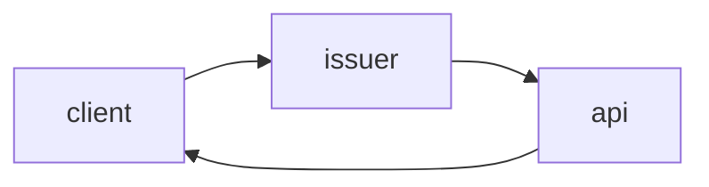
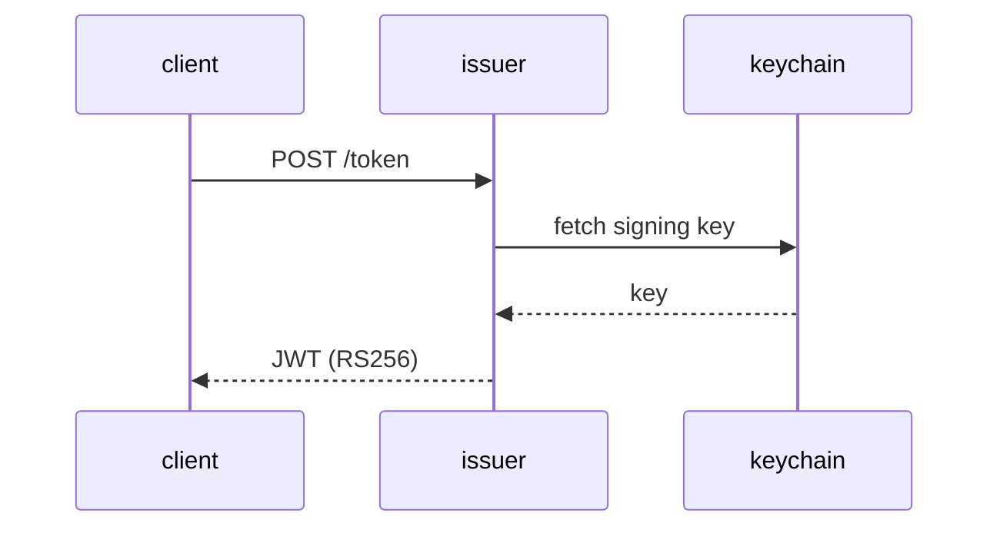

# review-rendering

## Summary

Replace session-cookie auth with short-lived JWTs issued by the auth service.
The diagram below shows issuance; elaboration and code live in phase Details.



## Decisions

- D1: RS256 over HS256 ← q7
- D2: Sessions table stays until phase 3 [assumed]

## Phases

### Phase 1 — Token issuance

Goal: Issue RS256 JWTs from the auth service.
Files:

- src/auth/issuer.ts
- src/auth/keys.ts
Verification: Unit tests cover issuance and key rotation.

#### Details

The issuer reads the signing key from the keychain at boot and rotates it
hourly. The sequence below elaborates the issuance flow stated in the goal.



```ts
export function issue(payload: Claims, key: PrivateKey): string {
  const token = sign(payload, key, { algorithm: "RS256", expiresIn: "15m" });
  return token;
}
```

```json
{
  "alg": "RS256",
  "typ": "JWT"
}
```

Rotation notes, exhaustively:

- rotation note 1: keys roll hourly; the previous key stays valid for one grace interval.
- rotation note 2: keys roll hourly; the previous key stays valid for one grace interval.
- rotation note 3: keys roll hourly; the previous key stays valid for one grace interval.
- rotation note 4: keys roll hourly; the previous key stays valid for one grace interval.
- rotation note 5: keys roll hourly; the previous key stays valid for one grace interval.
- rotation note 6: keys roll hourly; the previous key stays valid for one grace interval.
- rotation note 7: keys roll hourly; the previous key stays valid for one grace interval.
- rotation note 8: keys roll hourly; the previous key stays valid for one grace interval.
- rotation note 9: keys roll hourly; the previous key stays valid for one grace interval.
- rotation note 10: keys roll hourly; the previous key stays valid for one grace interval.
- rotation note 11: keys roll hourly; the previous key stays valid for one grace interval.
- rotation note 12: keys roll hourly; the previous key stays valid for one grace interval.
- rotation note 13: keys roll hourly; the previous key stays valid for one grace interval.
- rotation note 14: keys roll hourly; the previous key stays valid for one grace interval.
- rotation note 15: keys roll hourly; the previous key stays valid for one grace interval.
- rotation note 16: keys roll hourly; the previous key stays valid for one grace interval.
- rotation note 17: keys roll hourly; the previous key stays valid for one grace interval.
- rotation note 18: keys roll hourly; the previous key stays valid for one grace interval.
- rotation note 19: keys roll hourly; the previous key stays valid for one grace interval.
- rotation note 20: keys roll hourly; the previous key stays valid for one grace interval.
- rotation note 21: keys roll hourly; the previous key stays valid for one grace interval.
- rotation note 22: keys roll hourly; the previous key stays valid for one grace interval.
- rotation note 23: keys roll hourly; the previous key stays valid for one grace interval.
- rotation note 24: keys roll hourly; the previous key stays valid for one grace interval.
- rotation note 25: keys roll hourly; the previous key stays valid for one grace interval.
- rotation note 26: keys roll hourly; the previous key stays valid for one grace interval.
- rotation note 27: keys roll hourly; the previous key stays valid for one grace interval.
- rotation note 28: keys roll hourly; the previous key stays valid for one grace interval.
- rotation note 29: keys roll hourly; the previous key stays valid for one grace interval.
- rotation note 30: keys roll hourly; the previous key stays valid for one grace interval.
- rotation note 31: keys roll hourly; the previous key stays valid for one grace interval.
- rotation note 32: keys roll hourly; the previous key stays valid for one grace interval.
- rotation note 33: keys roll hourly; the previous key stays valid for one grace interval.
- rotation note 34: keys roll hourly; the previous key stays valid for one grace interval.
- rotation note 35: keys roll hourly; the previous key stays valid for one grace interval.
- rotation note 36: keys roll hourly; the previous key stays valid for one grace interval.
- rotation note 37: keys roll hourly; the previous key stays valid for one grace interval.
- rotation note 38: keys roll hourly; the previous key stays valid for one grace interval.
- rotation note 39: keys roll hourly; the previous key stays valid for one grace interval.
- rotation note 40: keys roll hourly; the previous key stays valid for one grace interval.
- rotation note 41: keys roll hourly; the previous key stays valid for one grace interval.
- rotation note 42: keys roll hourly; the previous key stays valid for one grace interval.
- rotation note 43: keys roll hourly; the previous key stays valid for one grace interval.
- rotation note 44: keys roll hourly; the previous key stays valid for one grace interval.
- rotation note 45: keys roll hourly; the previous key stays valid for one grace interval.
- rotation note 46: keys roll hourly; the previous key stays valid for one grace interval.
- rotation note 47: keys roll hourly; the previous key stays valid for one grace interval.
- rotation note 48: keys roll hourly; the previous key stays valid for one grace interval.
- rotation note 49: keys roll hourly; the previous key stays valid for one grace interval.
- rotation note 50: keys roll hourly; the previous key stays valid for one grace interval.
- rotation note 51: keys roll hourly; the previous key stays valid for one grace interval.
- rotation note 52: keys roll hourly; the previous key stays valid for one grace interval.
- rotation note 53: keys roll hourly; the previous key stays valid for one grace interval.
- rotation note 54: keys roll hourly; the previous key stays valid for one grace interval.
- rotation note 55: keys roll hourly; the previous key stays valid for one grace interval.
- rotation note 56: keys roll hourly; the previous key stays valid for one grace interval.
- rotation note 57: keys roll hourly; the previous key stays valid for one grace interval.
- rotation note 58: keys roll hourly; the previous key stays valid for one grace interval.

### Phase 2 — Middleware verification

**Goal:** Verify JWTs in the API middleware.
**Files:**

- src/middleware/jwt.ts
**Verification:** Integration tests hit a protected route with valid and expired tokens.

#### Details

The middleware swap is mechanical:

```ts before
app.use(cookieSession({ secret }));
```

```ts after
app.use(jwtVerify({ issuer: AUTH_ISSUER }));
```

Request flow after the swap:

```text
+--------+      +-----------+      +---------+
| client | ---> | jwtVerify | ---> | handler |
+--------+      +-----------+      +---------+
```

## Risks

- Key rotation downtime if the keychain is unavailable at boot.
- Clock skew between issuer and verifiers may reject fresh tokens.

## Open Questions

- Should refresh tokens land in this plan or a follow-up?
