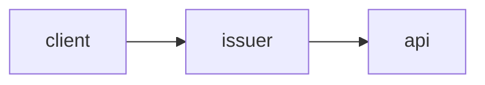

# auth-refactor

## Summary

Replace session-cookie auth with short-lived JWTs issued by the auth service.
Scope covers token issuance, middleware verification, and session-table removal.



## Decisions

- D1: RS256 over HS256 [assumed]
- D2: Sessions table stays until phase 3 [assumed]
  Kept for rollback safety during the migration window.

## Phases

### Phase 1 — Token issuance

Goal: Issue RS256 JWTs from the auth service.
Files:
- src/auth/issuer.ts
- src/auth/keys.ts
Verification: Unit tests cover issuance and key rotation.

#### Details

The issuer reads the signing key from the keychain at boot.

```ts
const token = sign(payload, key, { algorithm: "RS256" });
```

### Phase 2 - Middleware verification

**Goal:** Verify JWTs in the API middleware.
**Files:**

| File | What changed |
| ---- | ------------ |
| `src/middleware/jwt.ts` | verify the JWT and reject expired or bad-signature requests |
| `src/middleware/index.ts` | wire the verifier into the middleware chain |

**Verification:** Integration tests hit a protected route with valid and expired tokens.
**Out of scope:** Token revocation lists.

## Risks

- Key rotation downtime if the keychain is unavailable at boot.
- Clock skew between issuer and verifiers may reject fresh tokens.

## Open Questions

- Should refresh tokens land in this plan or a follow-up?
